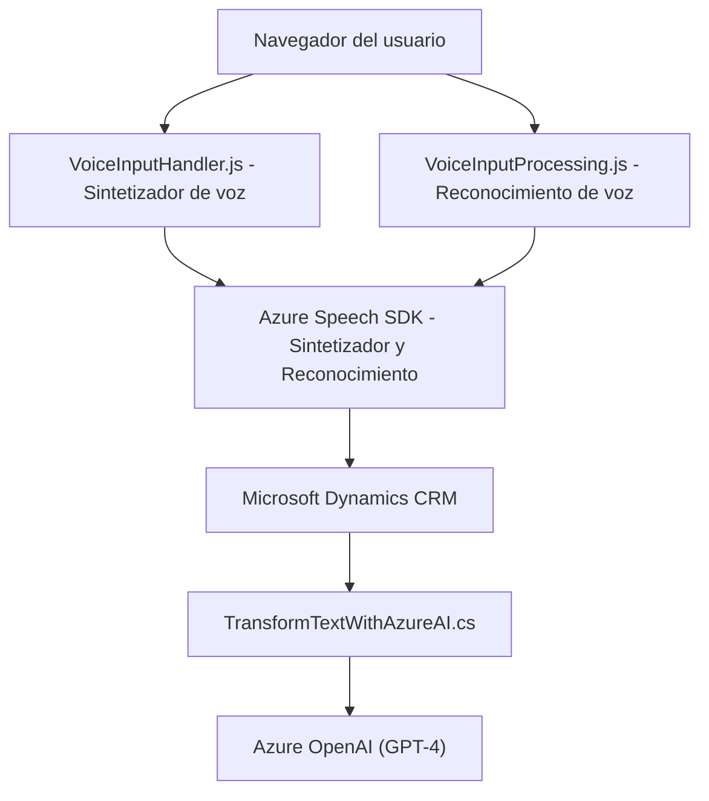

---

### Breve resumen técnico
Este repositorio está centrado en la construcción de componentes para integrar reconocimiento de voz, síntesis de audio, y procesamiento inteligente de texto en formularios interactivos de **Microsoft Dynamics CRM**, utilizando servicios de **Azure AI y Speech SDK**. Incluye módulos frontend (JavaScript) para interacción en tiempo real y un plugin backend (C#) para transformar datos con Azure OpenAI.

---

### Descripción de arquitectura
La arquitectura combina elementos de una solución **modular de n capas** con integración a servicios externos, como el **Speech SDK y Azure OpenAI**. La separación de responsabilidades está clara:  
- **Frontend:** Procesa interacciones de usuarios mediante reconocimiento de voz y síntesis de audio.  
- **Backend:** Realiza transformaciones avanzadas de texto usando IA.  
Adopta el patrón de **integración de servicios externos** y **plugin extensible**, que son característicos de las soluciones basadas en Dynamics CRM.

---

### Tecnologías usadas
1. **Frameworks/Core**:
   - JavaScript (Frontend).
   - .NET (C# Plugin).
2. **Servicios IA y SDK**:
   - Azure Speech SDK (reconocimiento de voz y síntesis de audio).
   - Azure OpenAI (GPT-4 para transformación inteligente de texto).
3. **Microsoft Dynamics CRM**:
   - API contextuales integradas para formularios y entidades CRM (`Xrm.WebApi`, plugins).  
4. **JSON Manipulación**:
   - `System.Text.Json` y `Newtonsoft.Json.Linq` (procesamiento JSON en C#).
5. **Patrones**:
   - Modularización (JS).
   - Plugin extensible (C#).
   - Dependency Injection (`IServiceProvider`).

---

### Diagrama Mermaid válido para GitHub

---

### Conclusión final
Este repositorio implementa una solución robusta basada en integraciones de **Microsoft Dynamics CRM**, **Azure Speech SDK**, y **Azure OpenAI** para reconocimiento de voz, síntesis avanzada de texto en audio, y procesamiento inteligente de datos con IA. La arquitectura mezcla patrones de n capas y plugins extensibles, aportando escalabilidad y reutilización. Los servicios externos son fundamentales para su funcionalidad, destacando la importancia de dependencias como el **Speech SDK** y **GPT-4**, que habilitan capacidades avanzadas de interacción con usuarios.