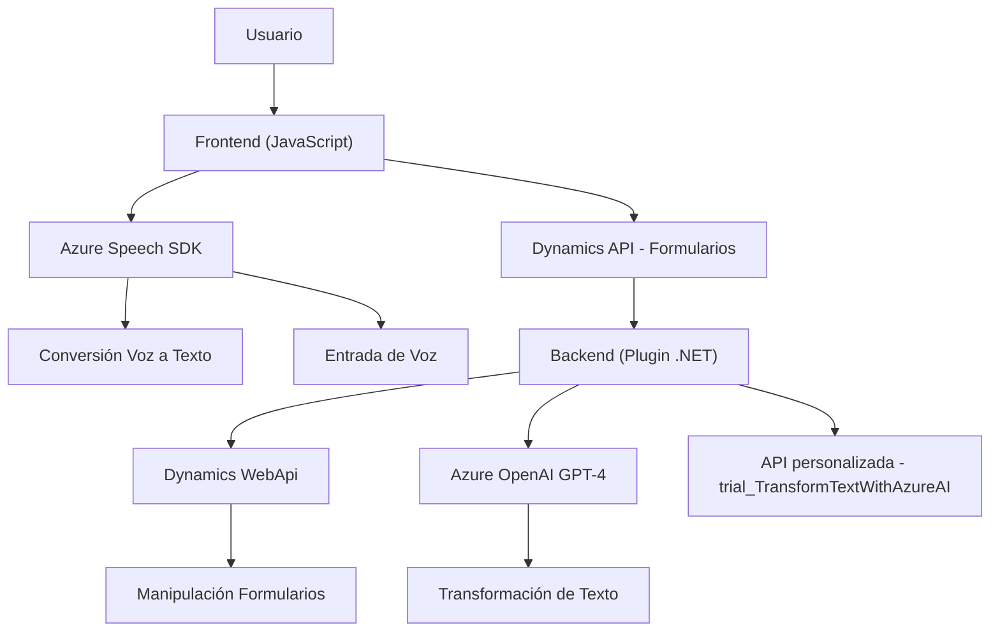

### Análisis y Explicación

#### 1. Tipo de Solución
El repositorio representa una solución que integra **frontend**, **plugins de backend** y la externalización de **servicios de inteligencia artificial (Azure OpenAI/GPT-4)** mediante API. De manera general, parece parte de un sistema centralizado en Dynamics 365, enfocado en formularios que implementan entrada por voz, síntesis de voz y procesamiento de datos usando inteligencia artificial.

---

#### 2. Tecnologías, Frameworks y Patrones Utilizados
##### Tecnologías/Frameworks:
   - **Frontend (JavaScript)**:
     - Utilización del **Azure Speech SDK** (cargado dinámicamente vía CDN).
     - Utilización de la API de formularios de **Dynamics 365** (`formContext`, `Xrm.WebApi`).
   - **Backend (.NET)**:
     - **Microsoft Dynamics CRM SDK**: Para extender la funcionalidad mediante plugins.
     - **Azure OpenAI GPT-4**: Servicio de transformación y procesado de texto.
     - **Newtonsoft.Json** y **System.Text.Json**: Manipulación de datos JSON.
     - **System.Net.Http**: Comunicación HTTP con servicios externos.
   - **APIs personalizadas**:
     - API de Dynamics ('trial_TransformTextWithAzureAI') para integrar procesamiento avanzado.

##### Patrones:
   - **Event-driven architecture**: Uso de triggers y eventos en Dynamics 365 para ejecutar lógicas específicas en plugins y mapas de formularios.
   - **Service Integration Pattern**: El código interactúa dinámicamente con servicios externos, como Azure Speech SDK y Azure OpenAI.
   - **Plugin Architecture**: Uso de plugins en Dynamics CRM para procesos específicos como transformación de texto.
   - **Single Responsibility Principle (SRP)**: Cada función tiene un propósito definido (extracción de campo, procesamiento de texto, integración de voz).
   - **Factory/Utility Methods**: Uso de funciones auxiliares como `applyValueToField` para manipular elementos dinámicos del formulario.
   - **Dynamic Loading**: Carga inmediata de Azure Speech SDK.

---

#### 3. Arquitectura
La arquitectura global del sistema parece ser una combinación de **arquitectura modular en frontend** y un enfoque en **n-capas** en el backend. Sin embargo, la alineación hacia integración de servicios y su interacción activa sugiere un modelo híbrido de **Hexagonal Architecture**:
   - **Frontend:** Modularidad para entrada/salida de voz y manipulación de formularios.
   - **Backend:** Plugins en Dynamics CRM, que actúan como componentes de negocio, delegando lógica de IA a servicios externos (Azure OpenAI).

---

#### 4. Dependencias o Componentes Externos
- **SDK Externos**:
  - **Azure Speech SDK**: Para síntesis de voz y reconocimiento.
  - **Azure OpenAI GPT-4**: Para transformación de texto.
- **Servicios personalizados de Dynamics CRM**:
  - APIs personalizadas como 'trial_TransformTextWithAzureAI'.
  - Funciones de manipulación de formularios dinámicos (formContext, Xrm.WebApi).
- **Bibliotecas en .NET**:
  - Manipulación JSON: `Newtonsoft.Json` y `System.Text.Json`.
  - Comunicación HTTP: `System.Net.Http`.

---

#### 5. Diagrama Mermaid (100% compatible con GitHub Markdown)

---

### Conclusión Final:
El sistema representa una solución bien integrada que utiliza una arquitectura híbrida orientada a eventos y servicios externos. El frontend utiliza tecnologías como Azure Speech SDK para la interacción directa con el usuario mediante voz y formularios dinámicos. En el backend, los plugins de Dynamics CRM manejan la lógica de negocio y delegan procesamiento avanzado a Azure OpenAI para transformación de datos, apoyándose en patrones como **integración con servicios externos** e **integración por API**.

Este diseño modular facilita el mantenimiento y escalabilidad, permitiendo extender funcionalidades tanto del frontend como del backend según se requiera.