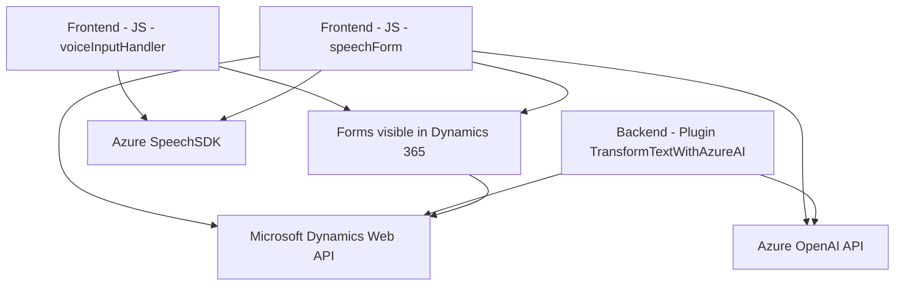

# Análisis de la solución

## Breve resumen técnico
La solución analizada presenta una implementación de funcionalidades para entrada y salida de voz en formularios relacionados con Microsoft Dynamics CRM, utilizando el **Azure Speech SDK** y la **API Azure OpenAI**. Se trata de un sistema que se integra con Dynamics 365, permitiendo tanto la síntesis de texto a voz como el procesamiento de voz a texto mediante servicios de inteligencia artificial en la nube. La arquitectura sigue un diseño modular, preparando el sistema para interacción con varios servicios web.

---

## Descripción de arquitectura

La solución parece formar parte de un sistema tipo **n capas**, capaz de extender las capacidades de una aplicación CRM. Los componentes analizados se dividen principalmente en dos capas:

1. **Frontend**: Implementado en JavaScript, este componente integra el SDK de Azure Speech para manejar entrada y salida de voz en formularios dinámicos. Realiza tareas como extracción de datos de formularios visibles, transformaciones de valores, integración con una API personalizada, y actualizaciones según la transcripción del audio.
   
2. **Backend**: Está representado por un plugin de Dynamics CRM desarrollado en .NET que utiliza Azure OpenAI para transformar un texto en un JSON estructurado. Este backend utiliza la API REST de Azure OpenAI para invocar las capacidades de la inteligencia artificial de GPT-4.

La arquitectura modular permite un bajo acoplamiento entre las capas y el uso de servicios externos para potenciar las capacidades del sistema. Aunque no es estrictamente un **monolito**, el sistema puede ser considerado como una solución **cliente-servidor** con integración de servicios de terceros.

---

## Tecnologías usadas

### Frontend
1. **JavaScript**: Lenguaje base del cliente.
2. **Azure Speech SDK**: Manejo de la síntesis y reconocimiento de voz.
3. **Microsoft Dynamics Web API (Xrm.WebApi)**: Utilizado para interactuar y manipular datos en formularios del CRM.

### Backend
1. **Microsoft Xrm SDK**: Para extender Dynamics CRM mediante plugins.
2. **Azure OpenAI API**: Consumo de IA para la transformación de texto.
3. **System.Text.Json**: Manejo de JSON en el backend.
4. **System.Net.Http**: Realización de solicitudes HTTP hacia servicios externos como la API de OpenAI.

---

## Dependencias o componentes externos
1. **Azure Speech SDK**: Para sintaxis texto-voz y voz-texto en el cliente.
2. **Azure OpenAI API**: Consumo de servicios de procesamiento en la nube para convertir texto en JSON estructurado.
3. **Microsoft Dynamics 365 Web API**: Para interactuar con datos del CRM.
4. **Plugin Dynamics CRM**: Modificación y personalización lógica desde la capa backend.

---

## Diagrama Mermaid

---

## Conclusión final
La solución combina las capacidades del Azure Speech SDK con las opciones de procesamiento avanzado de texto mediante Azure OpenAI. Esto permite la interacción en tiempo real con formularios en Dynamics 365, procesando voz y sintetizando respuestas mediante inteligencia artificial. Su arquitectura modular es adecuada para seguir estilos modernos, con roles bien definidos entre el cliente y el backend, y soporte para extensibilidad frente a nuevos servicios o funcionalidades. Sin embargo, se debe garantizar la gestión adecuada de las credenciales y límites de uso de las APIs externas para evitar problemas de seguridad o escalabilidad.