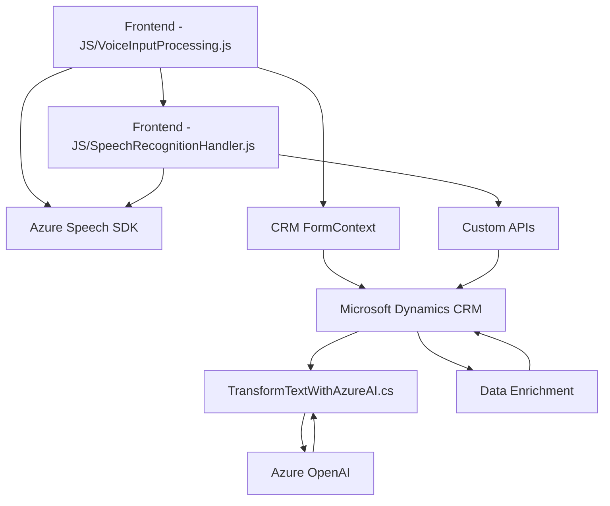

### Resumen técnico

El repositorio contiene múltiples archivos y está enfocado en la integración entre Microsoft Dynamics CRM, el servicio Azure Speech SDK y Azure OpenAI. Los archivos procesan datos de formularios en un entorno CRM, aprovechando tecnologías de reconocimiento de voz, síntesis de texto a voz y manipulación de inteligencia artificial. La estructura general refleja una solución que sirve como middleware para estandarización, procesamiento y entrada de datos en sistemas formales de negocio.

---

### Descripción de arquitectura

La solución está basada en una arquitectura híbrida y modular. **Características**:
1. **Modularización**: Cada archivo (JS o C#) tiene una responsabilidad completamente aislada, dividiendo claramente la lógica de frontend (procesamiento de voz en navegador) y backend (plugins en Dynamics CRM).
2. **Middleware API-driven**: Comunicación directa con el servicio Azure Speech SDK y Azure OpenAI a través de solicitudes HTTP y SDK específicos.
3. **Patrón n-capas**:
   - La lógica de frontend (archivos JS) interactúa con el backend CRM.
   - Los plugins en el backend CRM definen una capa extensible mediante el patrón de Microsoft CRM Plugins.
   - Integración con APIs externas (Azure Speech y Azure OpenAI) como capa adicional.

---

### Tecnologías usadas

#### **Frontend**
- **JavaScript**:
  - Principal lenguaje del procesamiento de voz y manipulación de formularios CRM.
  - Usa funciones asincrónicas para llamadas a servicios externos (Azure Speech y Azure OpenAI).
  - Interacción directa con el contexto CRM (`formContext`).

- **Azure Speech SDK**:
  - Para transformación de texto a voz y reconocimiento de voz.
  - Manejo mediante carga dinámica del SDK (evitando dependencias locales).

#### **Backend**
- **C#**:
  - Lenguaje empleado en el plugin de Dynamics CRM para realizar la transacción con Azure OpenAI.
  - Estructura basada en la interfaz `IPlugin`, que habilita la extensión de Dynamics CRM.
  
- **Azure OpenAI API**:
  - Servicio de transformación de texto en JSON estructurado utilizando inteligencia artificial generativa.

#### **Común**
- **Microsoft Dynamics CRM Web API**:
  - Consultas y manipulación de datos en el CRM (atributos, entidades y formularios).

---

### Dependencias externas

1. **Azure Speech SDK**:
   - Síntesis de voz (texto a voz) y reconocimiento.
   - Dinámicamente cargado en frontend con `JavaScript`.

2. **Azure OpenAI**:
   - Procesamiento avanzado de texto utilizando inteligencia artificial.
   - Comunicación con un endpoint seguro mediante HTTP desde el plugin C#.

3. **Microsoft Dynamics CRM Web API**:
   - Consultas (`retrieveMultipleRecords`) y ejecución de operaciones como actualizaciones al formulario.

4. **Librerías Backend**:
   - `System.Text.Json` y `Newtonsoft.Json.Linq` para el manejo de JSON.
   - `System.Net.Http` para solicitudes HTTP.

---

### Diagrama **Mermaid** válido para GitHub

---

### Conclusión final

Este repositorio implementa una solución que conecta tecnologías de reconocimiento de voz, síntesis de texto a voz y procesamiento inteligente de texto con un sistema formal de negocios (Microsoft Dynamics CRM). Utilizando un **patrón n-capas** y middleware API-driven, los componentes del sistema colaboran entre sí para procesar datos en tiempo real desde un entorno CRM. La integración con Azure Speech SDK y OpenAI refuerza la capacidad de interacción avanzada con formularios, optimizando procesos de entrada y edición. Aunque funcional, la solución podría beneficiarse de mejores prácticas como externalización de credenciales en servicios seguros.