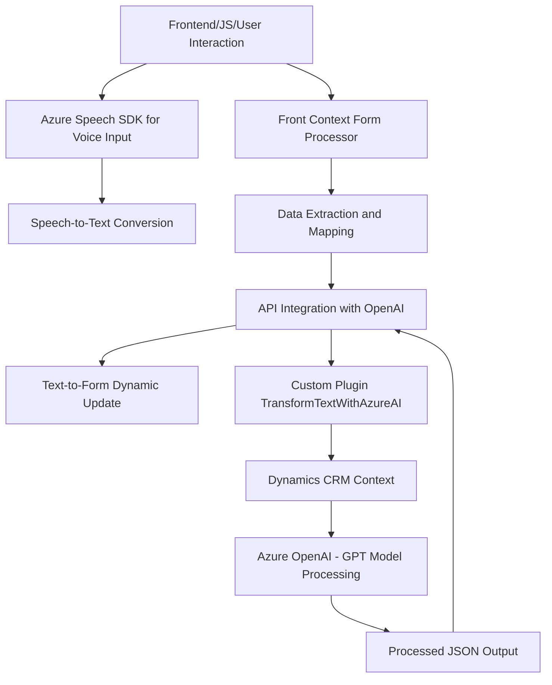

### Resumen técnico

El repositorio contiene tres componentes principales con una fuerte integración modular de servicios, principalmente **Azure Speech SDK** y **Azure OpenAI**. Estos archivos parecen ser parte de una solución híbrida que combina una interfaz de frontend basada en JavaScript, una capa dinámica de procesamiento de voz y texto en formularios, y un plugin utilizado en **Dynamics CRM**.

---

### Descripción de la arquitectura

La solución tiene características que permiten inferir una arquitectura **n capas** con módulos específicos para diferentes responsabilidades:

1. **Frontend/Interacción de usuario**: Archivos en la carpeta `FRONTEND/JS` que procesan formularios y voz en el cliente. Utilizan JavaScript para interactuar con SDK externos y APIs.
2. **Middle Layer/API personalizada**: Funciones internas en los scripts mencionados usan servicios basados en IA para procesar y actualizar datos, vinculando usuarios con dinámicas de formularios.
3. **Plugin para CRM**: Implementación basada en `IPlugin` para integrarse con el backend de **Dynamics CRM**, conectando CRM con Azure OpenAI para procesamiento y transformación de datos.

Aunque la arquitectura general parece escalable, no llega a ser totalmente **microservicios**, porque depende de una única estructura lógica de **n capas**, aunque los servicios externos como Azure se integren modularmente.

---

### Tecnologías, frameworks y patrones utilizados

1. **Tecnologías principales**:
   - **JavaScript/Browser**: Para la capa frontal.
   - **C#/.NET Framework**: Para desarrollo del plugin en Dynamics CRM.
   - **Azure Speech SDK**: Reconocimiento de voz y síntesis de texto.
   - **Azure OpenAI**: Procesamiento avanzado de texto desde IA usando modelos GPT.
2. **Frameworks/librerías**:
   - `Microsoft.Xrm.Sdk`: API para manejar Dynamics CRM.
   - `HttpClient`: Utilización para llamadas HTTP en C#.
   - `Newtonsoft.Json` y `System.Text.Json`: Bibliotecas de manipulación JSON.
3. **Patrones de diseño**:
   - **Event-driven programming**: Uso extensivo de callbacks y eventos, especialmente en `Frontend/JS`.
   - **Plugin pattern**: Implementación estándar de Dynamics CRM (`IPlugin`).
   - **Data Mapper**: Mapeo entre datos en transcripciones a atributos del formulario.
   - **Dependency Injection**: Utilizado a través de `IServiceProvider` en el plugin.

---

### Dependencias o componentes externos presentes

1. **Azure Speech SDK**: Integrado dinámicamente en los archivos JS para reconocimiento de voz y síntesis de texto.
2. **Azure OpenAI Service**: Usado dentro del plugin para aplicar IA (GPT para procesamiento de texto).
3. **Dynamics CRM API**: Plugin que interactúa con el contexto de organización y datos CRM.
4. **Bibliotecas estándar JS y .NET**:
   - JavaScript: No es explícito en los archivos, pero podría incluir jQuery u otras herramientas para manipulación DOM/formularios.
   - **Newtonsoft.Json** para manipulación fluida de JSON en C#.

---

### Diagrama Mermaid para GitHub Markdown

---

### Conclusión final

Esta solución constituye una aplicación que implementa una interacción rica con formularios mediante el uso de reconocimiento de voz y procesamiento de texto avanzado. Su diseño modular dividido entre frontend, backend (Dynamics CRM plugin), y servicios externos le otorgan flexibilidad y escalabilidad, aunque la dependencia de Azure limita la independencia del sistema. El uso de patrones como callback y mapeo de datos permite eficiencia en la manipulación de datos contextuales y en tiempo real. La arquitectura **n capas** combinada con integración de APIs proporciona una estructura clara, pero no llega al nivel de microservicios por la ausencia de separación de responsabilidades independientes en infraestructura.