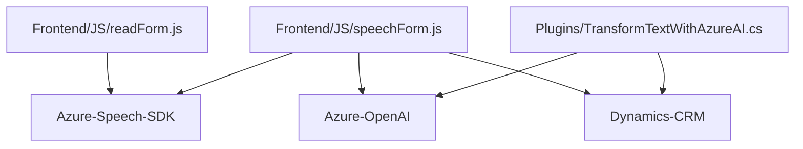

### Breve resumen técnico
El repositorio presenta una solución que implementa una experiencia avanzada de reconocimiento y síntesis de voz, integrándose con formularios interactivos de Microsoft Dynamics CRM. Usa servicios externos como el Azure Speech SDK y posee integraciones con APIs personalizadas de procesamiento y transformación de texto a través de Azure OpenAI. Los archivos muestran estructura modular, patrones orientados a servicios y soporte para escenarios de interactividad y accesibilidad en tiempo real.

### Descripción de arquitectura
La arquitectura incluye múltiples capas organizadas en un **Modelo-Vista-Controlador (MVC)** con **Microservicios**. El frontend (JavaScript) interactúa directamente con los formularios del Dynamics CRM y utiliza Azure SDK y APIs personalizadas para la síntesis y el reconocimiento de voz. El plugin escrito en C# actúa como intermediario entre Dynamics CRM y Azure OpenAI, aplicando un enfoque descentralizado con integración de servicios externos.

### Tecnologías utilizadas
1. **Tecnologías Back-End**:
   - **C#** para el desarrollo del plugin en Dynamics CRM.
   - **Microsoft Dynamics CRM SDK (Microsoft.Xrm.Sdk)** para la gestión de entidades externas.
   - **Azure OpenAI (API)** para la transformación de texto en un JSON estructurado.
   - **Newtonsoft.Json.Linq & System.Text.Json** para la manipulación de JSON.

2. **Tecnologías Front-End**:
   - **JavaScript** para la manipulación DOM y lógica en el browser.
   - **Azure Speech SDK** para la síntesis y el reconocimiento de voz.
   - **Xrm.WebApi** para comunicación con el backend a través de APIs personalizadas.

3. **Frameworks y servicios externos**:
   - **Azure Speech SDK** para voz y texto.
   - **Azure OpenAI API** para procesamiento basado en inteligencia artificial.

4. **Patrones Arquitectónicos**:
   - **Modular Programming**: Las funciones en JavaScript están claramente divididas en módulos independientes.
   - **Facade Pattern**: Encapsulación de la configuración y uso de SDK externo con interfaces específicas.
   - **Plugin Design Pattern**: Utilizado en el archivo de C# como pieza autónoma de extensibilidad.
   - **Service Oriented Architecture (SOA)**: Integración y consumo de servicios web externos mediante SDKs y APIs REST.

### Diagrama **Mermaid** válido para GitHub

### Conclusión final
La solución propuesta se alinea con una arquitectura **modular y orientada hacia servicios**, predominando las interacciones entre los módulos internos y servicios externos. Los archivos JavaScript presentan un enfoque orientado a mejorar la experiencia del usuario con accesibilidad y reconocimiento de voz en formularios dinámicos; mientras que el plugin en C# aprovecha Azure OpenAI para tareas avanzadas relacionadas con inteligencia artificial. La elección de arquitecturas y tecnologías es apropiada para su propósito, mostrando un diseño bien estructurado y eficiente.