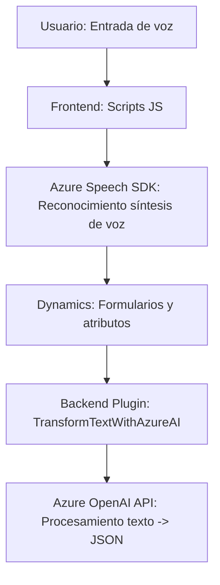

**Breve resumen técnico:**

El repositorio parece estar diseñado para un sistema que integra diversos componentes relacionados con el reconocimiento y síntesis de voz, procesamiento de datos extraídos de formularios en Dynamics CRM y transformación de texto con Azure AI. Los scripts de JavaScript actúan como frontend conectados al backend Dynamics 365 y al SDK de Azure Speech. El archivo central de C# implementa un plugin específico del CRM, facilitando integración con IA de OpenAI. Esto apunta a una solución que combina capacidades frontend/backend con integración de servicios externos.

---

### **Descripción de arquitectura**

La arquitectura del sistema sigue un enfoque **modular** y dividido en capas principales:
1. **Frontend**
   - Scripts en JavaScript (`readForm.js`, `speechForm.js`) con integración directa por medio del SDK de Speech Azure.
   - Responsable de manejar los eventos de usuario (reconocimiento de voz, síntesis de texto, inputs).

2. **Servicios externos** 
   - Comunicación con el SDK de Azure Speech para la funcionalidad de voz y el API de OpenAI (Azure) desde el plugin.
   - Dynamically load Speech SDK from an Azure source.

3. **Plugin (Backend)**
   - Desarrollado utilizando C# (`TransformTextWithAzureAI.cs`), ejecuta procesos como transformación de texto mediante reglas definidas (JSON).
   - Funciona como un plugin para Dynamics CRM, extendiendo su funcionalidad (acción personalizada).

### **Tipo de arquitectura:**  
La solución combina características de:
- **Cliente-Servidor:** El frontend trata directamente con el usuario, recogiendo datos de formularios y eventos asociados.
- **N-capas:** Existen capas separadas para frontend, servicios externos (Azure) y el backend (Dynamics Plugins).
- **Integración con servicios externos (híbrida):** El uso de SDK y APIs externas refuerza el patrón híbrido con soluciones SaaS (Azure).

---

### **Tecnologías usadas**

#### **Frontend**
- **JavaScript:** Codificación en archivos frontend (`readForm.js`, `speechForm.js`).
- **Azure Speech SDK:** Para reconocimiento y síntesis de texto a voz desde un navegador.
- **Dynamics CRM API:** Interacción con formularios contextuales.

#### **Backend (Plugin)**
- **C# (.NET Framework):** Implementación de la lógica del plugin para Dynamics CRM.
- **Microsoft Dynamics SDK:** Herramientas y métodos estándar para extender la funcionalidad del CRM.
- **Azure OpenAI API:** Procesamiento del lenguaje natural mediante GPT o similares.
- **Newtonsoft.Json y JSON.Net:** Manejo de estructuras de respuesta JSON.

#### **Patrones arquitectónicos**
- **Modularidad:** Dividir funciones específicas (reconocer voz, actualizar formularios, transformar texto).
- **Carga dinámica de dependencias:** Garantizar que Speech SDK esté disponible antes de usarlo.
- **Integración SaaS:** Dependencia de servicios proporcionados vía Azure para agregar capacidades dinámicas al sistema.
- **Plugin CRM:** Patrón de diseño centrado en la extensión modular del CRM.

---

### **Diagrama Mermaid**

---

### **Conclusión final**
Este repositorio presenta una solución híbrida que integra capacidades avanzadas de reconocimiento de voz y procesamiento de lenguaje natural con un sistema CRM robusto como Dynamics 365. El uso de tecnologías de Azure y técnicas de transformación mediante OpenAI API, junto con un plugin y scripts frontend, lo posicionan como una solución moderna y extensible.

Se observa coherencia en términos de modularidad y separación de responsabilidades, mientras que la arquitectura clave es claramente orientada a capas con servicios distribuidos externos.