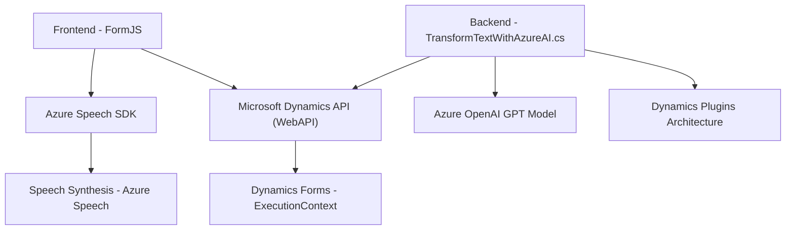

### Breve resumen técnico
El repositorio presentado parece formar parte de un sistema que integra inteligencia artificial y tecnologías de voz para enriquecer la interacción con formularios de Microsoft Dynamics 365. Consiste en archivos para un frontend en JavaScript y un backend con plugins de .NET para Dynamics CRM, además de la integración con servicios externos como **Azure Speech** y **Azure OpenAI**.

---

### Descripción de arquitectura
La solución utiliza una arquitectura híbrida basada en capas y servicios externos. En el frontend, se observa una organización orientada a funciones y servicios con integración de SDKs de Azure Speech. En el backend, se implementa una arquitectura basada en **Plugins** (Dynamics CRM) y servicios para interacción con APIs externas. La interoperabilidad entre frontend y backend está centrada en el uso del contexto de Dynamics 365 y estados de formulario (executionContext y APIs relacionadas).

---

### Tecnologías usadas
1. **JavaScript**: Para el frontend (manejo de formularios y Azure Speech SDK).
2. **Azure Speech SDK**: Para síntesis y reconocimiento de voz.
3. **Dynamics 365 Web API**: Utilizada en el frontend y backend para interacción con formularios y entidades CRM.
4. **.NET Framework (.NET)**: Para desarrollo de plugins en el backend.
5. **Azure OpenAI (GPT)**: Lógica de transformación avanzada de texto en el backend.
6. **Newtonsoft.Json**: Para manejar transformación y manipulación de objetos JSON.
7. **System.Net.Http**: Para interacción HTTP con servicios externos.

---

### Diagrama Mermaid válido para GitHub
A continuación se presenta un esquema simplificado de los componentes principales. 

---

### Conclusión final
La solución descrita pertenece a un **sistema híbrido** orientado a formularios, que utiliza un enfoque basado en **capas funcionales** y **integraciones con servicios externos (Azure APIs)** para manejar tareas automatizadas de síntesis, reconocimiento de voz, y transformación de texto. Este diseño permite enriquecer la experiencia de usuario en el CRM de Dynamics 365 en escenarios como la accesibilidad y la gestión avanzada de datos con inteligencia artificial.