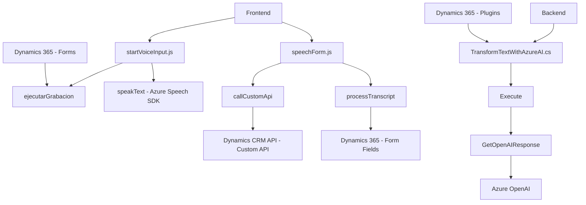

### Resumen técnico
El repositorio contiene tres archivos clave que forman una solución enfocada en automatizar y enriquecer la interacción con formularios dentro de Dynamics 365. Se basa en la integración con servicios de Azure, como Speech SDK y OpenAI, para procesos de entrada y salida de voz, así como transformación avanzada de texto. Es principalmente una solución híbrida para el manejo de datos con funciones de frontend y backend.

---

### Descripción de arquitectura
La arquitectura general combina patrones de **n capas** y **microservicios**. Mientras que los archivos JavaScript desempeñan funciones en el cliente para enriquecer la experiencia del usuario en el navegador (similar a frontend), el archivo C# despliega un **plugin basado en eventos** directamente en Dynamics CRM, que ejecuta peticiones desde el backend hacia servicios externos de Azure.

Los archivos de JavaScript utilizan estructuras orientadas a módulos y servicio (integración con Azure SDK), mientras que el archivo C# implementa un plugin como parte de una arquitectura extensible. El uso de recursos dinámicos de Azure, y la interacción con APIs personalizadas y servicios externos, muestra una estructura distribuida con componentes desacoplados.

---

### Tecnologías usadas
1. **Lenguajes y Frameworks**:
   - `JavaScript`: Para lógica de interacción con formularios dentro del frontend.
   - `C#`: Implementación de extensiones basadas en eventos usando Plugins para Dynamics CRM.

2. **Servicios externos y dependencias**:
   - **Azure Speech SDK**: Usado en los archivos de frontend para síntesis y reconocimiento de voz.
   - **Azure OpenAI**: Usado en el Plugin para realizar transformación de texto.
   - **Dynamics CRM API**: 
     - Contexto de Formulario (field mapping y actualización de campos). 
     - API personalizada para transcripción y transformación de datos.

3. **Bibliotecas externas**:
   - `Newtonsoft.Json.Linq` y `System.Text.Json`: Manipulación de datos JSON en el Plugin.

4. **Patrones de diseño**:
   - Modular: Cada función tiene un propósito específico y se desacopla de otras.
   - Código asincrónico en JavaScript (callbacks y promesas).
   - Plugins: Estilo tradicional de extensibilidad basado en eventos de Dynamics CRM.
   - Integración con microservicios: Delegación lógica hacia los servicios Azure Speech y OpenAI.

---

### Diagrama Mermaid

---

### Conclusión final
Este repositorio implementa una solución tecnológica híbrida que combina un diseño basado en **n capas** con **microservicios externos**. En el frontend, utiliza JavaScript para integrar Azure Speech SDK y Dynamics CRM, ofreciendo una interfaz interactiva con entrada de voz. En el backend, emplea un Plugin en C# que extiende Dynamics CRM con procesamiento avanzado de texto utilizando Azure OpenAI. La modularidad y el desacoplamiento del código aseguran una arquitectura escalable y compatible con escenarios empresariales de automatización y enriquecimiento de formularios CRM.