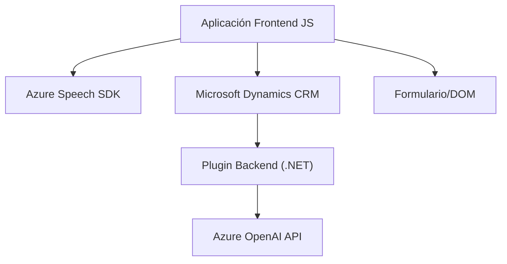

### Breve resumen técnico

El contenido proporcionado describe un repositorio que incluye una solución multifacética centrada en integrar funcionalidades avanzadas de reconocimiento y síntesis de voz, así como procesamiento de texto usando inteligencia artificial (Azure OpenAI). La solución interactúa con Microsoft Dynamics CRM mediante plugins personalizados.

### Descripción de arquitectura

1. **Tipo de solución:**
   - El repositorio combina diferentes componentes, incluyendo:
     - **Frontend (JavaScript):** Funcionalidad para interactuar con formularios y manejar síntesis de voz utilizando Azure Speech SDK.
     - **Plugins en Backend (.NET/C#):** Extensiones a Dynamics CRM para procesamiento de datos vía Azure OpenAI.
     - Uso de APIs externas (Azure).
   
2. **Arquitectura:** 
   - La solución presenta una **arquitectura híbrida basada en capas**, donde las piezas se acoplan estructuralmente a través de una integración backend (Dynamics CRM), un cliente frontend (JavaScript), y llamadas a servicios externos (Azure Speech SDK y Azure OpenAI).
   - **Hexagonal patterns** se identifican en el plugin backend, donde los servicios de Azure OpenAI actúan como puertos para la transformación de datos. El frontend utiliza un enfoque modular y de integración de servicios externos similar.
   - **Event-driven programming**: Implementado en la parte del frontend mediante el uso de callbacks y ejecución dinámica basada en eventos.

### Tecnologías usadas

- **Frontend (JavaScript):** 
  - Azure Speech SDK: Utilizado para convertir texto en voz o manejar inputs hablados.
  - JavaScript estándar con manipulación del DOM.
  - Dinámicas de asincronismo con Promises y callbacks.

- **Backend (.NET):**
  - Microsoft Dynamics CRM SDK: Conexión y extensión del sistema CRM.
  - Azure OpenAI: Procesamiento avanzado del lenguaje natural.
  - .NET Framework y C#.
  - Bibliotecas: `Newtonsoft.Json`, `System.Text.Json`, `System.Net.Http`.

- **Patrones arquitectónicos:**
  - Modularización para encapsular responsabilidades.
  - Plugin architecture para CRM.
  - Event-driven para el manejo de eventos asíncronos.
  - Adapter Pattern para la integración de servicios externos.

### Dependencias o componentes externos

- **Azure Speech SDK:** Para la síntesis de texto en audio y el reconocimiento de voz.
- **Azure OpenAI API:** Para transformar texto en estructuras semánticas específicas.
- **Microsoft Dynamics CRM SDK:** Para interactuar con datos esenciales en CRM.
- **Sistema de dependencias frontales:** Dinámicas centradas en el modelo DOM y JavaScript convencional.

---

### Diagrama Mermaid válido para GitHub

---

### Conclusión final

Este repositorio representa una solución modular constructiva e integradora que combina la interacción de tecnologías Frontend y Backend, integradas bajo un ambiente Cloud/CRM. Desde el frontend en JavaScript, se maneja la entrada y salida basada en voz utilizando el API de Azure Speech SDK. En el backend, los datos procesados son transformados hacia un formato estructurado mediante un plugin que conecta con Azure OpenAI. Esto sugiere una arquitectura robusta y adaptable, diseñada para entornos empresariales modernos con soporte de servicios externos, aunque podría beneficiarse de una revisión de la gestión de credenciales del API.