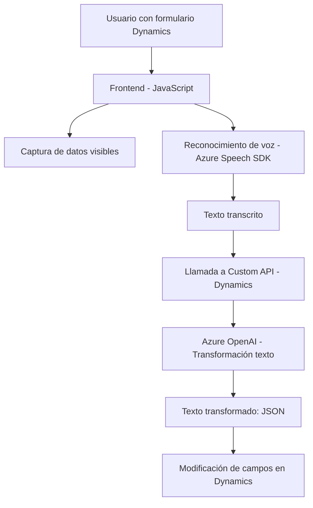

### Breve Resumen Técnico:
El repositorio parece estar construido para un sistema que utiliza reconocimiento y entrada de voz con **Azure Speech SDK** y procesamiento de texto asistido por servicios **Azure OpenAI**. Está orientado principalmente a interactuar con formularios gestionados en el entorno de **Microsoft Dynamics CRM**. Incluye tanto componentes frontend (JavaScript, para interacción directa con usuarios) como backend (C# Plugins para procesar datos en Dynamics CRM).

---

### Descripción de Arquitectura:
La solución presenta características de una **arquitectura n-capas**:
1. **Capa de Presentación**: Archivos frontend en JavaScript para interacción del usuario, captura de datos visibles en formularios, y síntesis de voz.
2. **Capa de Comunicación**: Integración de servicios externos como Azure Speech SDK y Dynamics CRM API.
3. **Capa de Aplicación/Negocio**: Plugins en C# procesan datos y actúan como lógica de negocio, transformando texto y realizando comunicación directa con **Azure OpenAI**.

La modularización del código, y la separación entre frontend y backend, refuerzan patrones como el **Desacoplamiento** y la **responsabilidad única**.

---

### Tecnologías Usadas:
1. **Tecnologías Frontend**:
   - Azure Speech SDK: Para reconocimiento de voz y síntesis de texto en voz.
   - JavaScript: Para interacción con formularios y manejo del SDK Azure Speech.

2. **Tecnologías Backend**:
   - C#: Desarrollo de Plugins para la lógica de negocio en Dynamics CRM.
   - Microsoft Dynamics CRM SDK: Manipulación avanzada de formularios y atributos.
   - Azure OpenAI: Procesamiento y transformación de texto usando inteligencia artificial.
   - HTTP API: Comunicación con el servicio OpenAI.

3. **Patrones Arquitectónicos**:
   - **Nivel de abstracción**: Funciones en el código dividen responsabilidades (procesamiento de texto, síntesis de voz, comunicación con servicios externos).
   - **Módulo de Helper**: Métodos auxiliares y encapsulados (`GetOpenAIResponse` en el plugin C#).
   - **Carga asíncrona**: Frontend maneja la carga dinámica del Azure Speech SDK para garantizar disponibilidad solo cuando es necesario.
   - **Desacoplamiento**: Uso de APIs externas para limitar la lógica implementada directamente en el repositorio.

---

### Dependencias o Componentes Externos:
1. **Azure Speech SDK**: Reconocimiento y síntesis de voz en interfaz de usuario.
2. **Azure OpenAI**: Procesamiento de texto asistido por IA, utilizado dentro de Plugins.
3. **Microsoft Dynamics CRM SDK**:
   - Manipulación de formularios.
   - Contextos dinámicos para plugins.
4. **Librerías para solicitudes HTTP**:
   - `System.Net.Http` y `System.Text.Json` en C# para comunicación con servicios externos.
5. **Frontend**:
   - APIs de navegador (`document.head` y DOM manipulation).
6. **Custom API**:
   - Integración con Dynamics CRM mediante funciones específicas (`trial_TransformTextWithAzureAI`).

---

### Diagrama Mermaid:

---

### Conclusión Final:
Este repositorio implementa una solución enfocada en la interacción entre usuarios y formularios en **Microsoft Dynamics CRM** mediante reconocimiento de voz, síntesis verbal, y procesamiento avanzado de texto por IA. La arquitectura n-capas está claramente planteada, con lógica separada entre frontend (recolección y voz) y backend (transformación y manipulación en el CRM). La integración con Azure Speech SDK y Azure OpenAI aporta innovación, pero también implica depender de servicios de terceros. La modularización y los patrones utilizados facilitan su mantenimiento y escalabilidad.