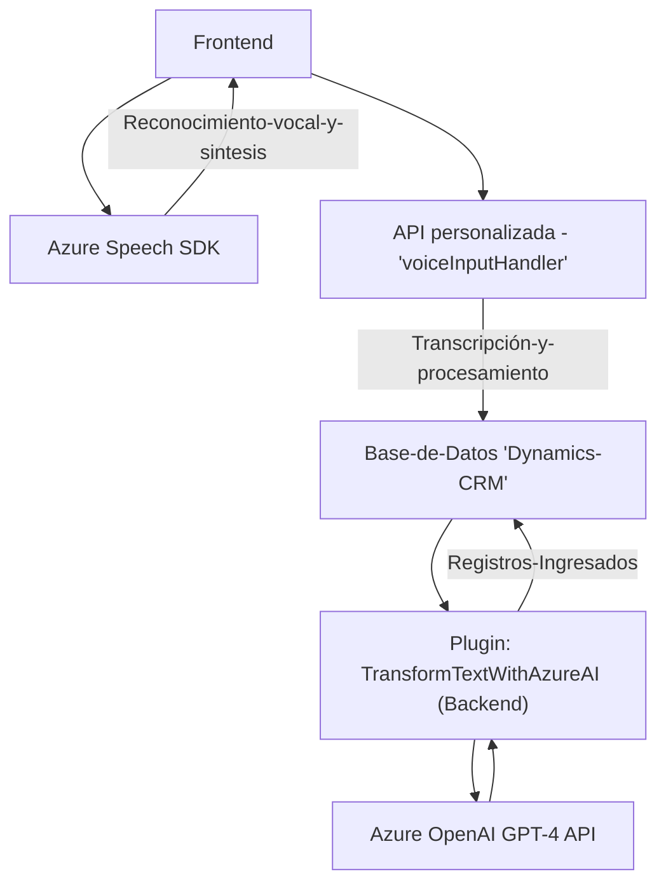

### Breve resumen técnico
La solución presentada tiene un enfoque para integrarse con Dynamics CRM y extender su funcionalidad mediante un conjunto de módulos frontend (JavaScript) y backend (.NET Plugin) que se comunican, respectivamente, con Azure Speech SDK y Azure OpenAI. El objetivo principal es interactuar con el usuario mediante voz y convertir texto hablado o escrito en datos estructurados procesados por los formularios disponibles en Dynamics CRM.

### Descripción de arquitectura
- **Tipo de solución:** Sistema híbrido compuesto por un frontend (JS) para la interfaz y el procesamiento en tiempo real con una API externa (Azure Speech SDK), y un backend basado en plugins (.NET) para integración con Dynamics CRM y procesamiento adicional mediante Azure OpenAI.
- **Patrones de Arquitectura:**
  - **Arquitectura de n-capas:** La solución tiene una clara separación entre frontend y backend. El frontend realiza la entrada y salida de datos hacia el usuario, mientras que el backend gestiona la lógica empresarial asociada.
  - **Modularización por tareas específicas:** Cada archivo y función tiene una responsabilidad definida, contribuyendo a un diseño modular y sustentable.
  - **Integración con microservicios:** El sistema interactúa en tiempo real con servicios externos como Azure Speech SDK y OpenAI mediante interfases específicas diseñadas para los servicios en la nube.

### Tecnologías usadas
- **Frontend (JavaScript):**
  - **Azure Speech SDK:** Para reconocimiento de voz y síntesis de texto a voz.
  - **Browser DOM API:** Para la manipulación del documento HTML y la carga dinámica del SDK.
- **Backend (.NET):**
  - **Microsoft Dynamics CRM SDK:** Para gestion de negocio basado en eventos y datos de Dynamics CRM.
  - **Azure OpenAI GPT-4 via REST API:** Para transformar texto en JSON estructurado.
  - **Newtonsoft.Json, System.Text.Json:** Para las tareas de serialización y deserialización de datos JSON.
  - **HttpClient:** Para realizar solicitudes HTTP hacia Azure OpenAI y otras APIs en el futuro.

### Dependencias o componentes externos
1. **Azure Speech SDK:** Se utiliza para la síntesis y reconocimiento de voz en el frontend.
2. **Azure OpenAI GPT-4 API:** Permite procesar y transformar textos, proporcionando un JSON estructurado.
3. **Dynamics CRM SDK:** Empleado para interactuar con el modelo/servicio de datos en servidores de Dynamics CRM.
4. **Microsoft.NET framework:** Utilizado por el plugin backend como parte del entorno de desarrollo.
5. **Browser APIs:** Permiten manejar eventos y realizar operaciones dinámicas en el frontend.
6. **HTTP Communications:** Soporte para comunicación continua con servicios de Azure en tiempo real.

### Diagrama Mermaid

Un diagrama explicativo de alto nivel de las interacciones de los componentes involucrados en la solución:

### Conclusión final
La solución es un sistema integral híbrido diseñado para estandarizar y optimizar la interacción con formularios en un entorno de CRM utilizando los servicios en la nube de Azure. La arquitectura implementada es modular y extensible, con claras separaciones entre el frontend basado en JavaScript y un backend desarrollado con Microsoft Dynamics CRM SDK y .NET. La integración con servicios de Azure mediante SDK y APIs también permite escalar la solución según las necesidades de negocio, lo que resulta en un diseño moderno y adaptable para interacciones con voz y procesamiento de datos automáticos.