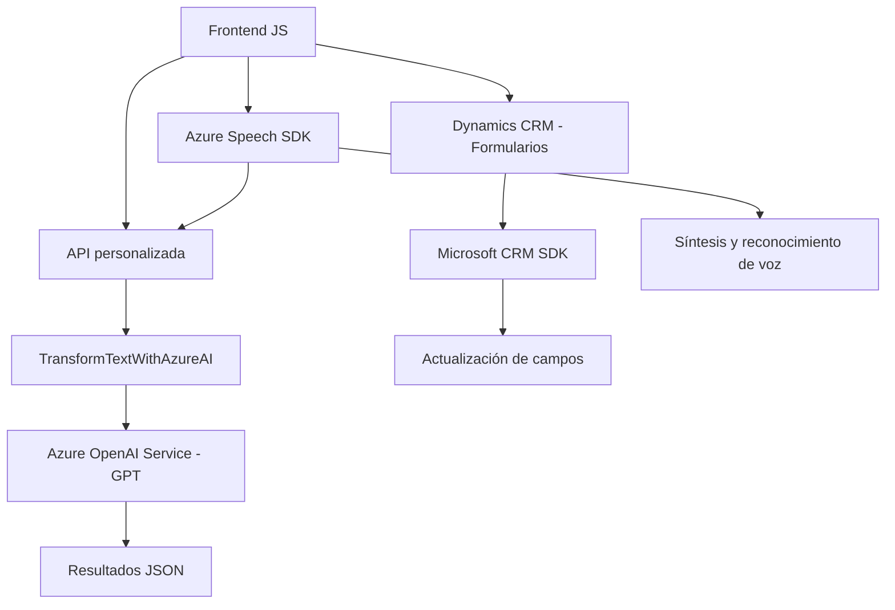

### Resumen Técnico
El repositorio está diseñado para integrar funcionalidades avanzadas de procesamiento de voz, síntesis y reconocimiento de voz dentro de un sistema CRM, utilizando Azure Speech SDK y una API personalizada basada en Azure OpenAI. Los componentes se dividen en tres capas: frontend (JavaScript), backend (C# Plugin), y dependencias externas como Azure Speech SDK y Azure OpenAI.

---

### Descripción de la Arquitectura
La solución implementa una arquitectura híbrida que combina **n capas** (separación clara entre frontend, lógica de negocio en plugins, y dependencias externas) con **integración de servicios externos**, lo que la acerca hacia un patrón **SOA (Service-Oriented Architecture)**. Los componentes JavaScript manejan la interacción del cliente con la interfaz de usuario y las funcionalidades de voz, mientras que los plugins en C# ejecutan lógica de negocio más pesada y gestionan transformaciones de texto mediante servicios OpenAI.

---

### Tecnologías y Frameworks Utilizados
1. **Lenguajes utilizados**:
   - **JavaScript**: Para el frontend (integración con Dynamics CRM y gestión de SDKs de voz).
   - **C# (.NET Framework)**: Para los plugins del backend de Dynamics CRM.
2. **Frameworks y herramientas**: 
   - **Azure Speech SDK**: Síntesis y reconocimiento de voz.
   - **Azure OpenAI GPT-4o**: Procesamiento avanzado de texto.
   - **Dynamics CRM SDK**: Extensiones personalizadas del CRM (gestión de atributos y formularios).
   - **Newtonsoft.Json.Linq** y **System.Text.Json**: Para manejar objetos JSON en C#.
   - **DOM APIs**: Para cargar dinámicamente el Speech SDK en el navegador.
3. **Patrones de diseño utilizados**:
   - **Facade Pattern**: Simplificación del acceso a funcionalidades internas en ambas capas (JavaScript y C#).
   - **Service-Oriented Architecture (SOA)**: Integración directa con servicios externos, como el Speech SDK y Azure OpenAI.
   - **Modularización**: Separación de responsabilidades por función/clase.

---

### Dependencias y Componentes Externos
1. **Azure Speech SDK**:
   - Carga dinámica desde: `https://aka.ms/csspeech/jsbrowserpackageraw`.
   - Funcionalidades: síntesis y reconocimiento de voz.
2. **Azure OpenAI GPT-4o**:
   - API para procesamiento avanzado de texto.
   - Endpoints definidos en los plugins para realizar llamadas directas.
3. **Microsoft Dynamics CRM SDK**:
   - APIs del CRM para recuperación y actualización de datos de formularios.
   - Integrado en los scripts del frontend y en el backend.
4. **Bibliotecas externas en C#**:
   - `Webhook` APIs, `Newtonsoft.Json`, `System.Net.Http` para consumir las APIs externas.

---

### Diagrama **Mermaid** (100 % compatible con GitHub Markdown)
Este diagrama muestra los componentes principales, las interacciones clave y los flujos de datos.

---

### Conclusión Final
Este repositorio integra de forma efectiva funcionalidades avanzadas ligadas al procesamiento de voz y texto, con un enfoque centrado en Microsoft Dynamics CRM. Usa tecnologías de última generación como Azure Speech SDK y Azure OpenAI, adoptando patrones de modularidad para separar responsabilidades y facilitar la extensibilidad. La arquitectura híbrida permite una interacción fluida entre cliente, lógica de negocio personalizada, y servicios externos. Es una solución robusta ideal para escenarios CRM altamente personalizados basados en interacción de voz y procesamiento inteligente de texto.