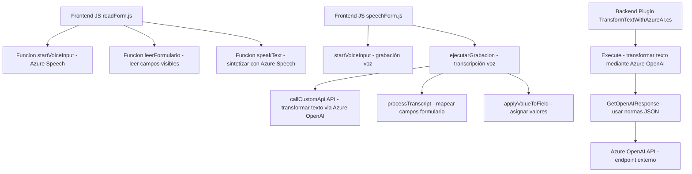

### Breve Resumen Técnico
El repositorio presenta una solución integrada que utiliza tecnologías y servicios externos para gestionar entrada por voz, lectura de formularios visuales y procesamiento automático de información. Además, incluye un componente de backend (plugin) que transforma texto mediante Azure OpenAI. Éstos se vinculan principalmente a plataformas como Microsoft Dynamics CRM.

---

### Descripción de Arquitectura
La solución está estructurada con componentes frontend y backend siguiendo una arquitectura **n-capas**:
1. **Frontend**: Manejo de entrada y salida de voz, interacción con el usuario y lectura de formularios.
   - Arquitectura modular y basada en cliente.
   - Fragmentos de lógica distribuidos en funciones reutilizables.
2. **Backend**: Plugins para Dynamics CRM que procesan texto mediante Azure OpenAI y proporcionan resultados en formato JSON estructurado.
   - Arquitectura basada en eventos propios de Dynamics CRM y comunicación con APIs externas.

---

### Tecnologías Usadas
1. **Frontend (JavaScript)**:
   - **Azure Speech SDK**: Para entrada de voz y síntesis de texto a voz.
   - **Xrm.WebApi.online**: API de Dynamics para consultas y operación backend.
   - **Helper Functions**: Funciones auxiliares y reutilizables para la manipulación de datos de formularios.
2. **Backend (.NET)**:
   - **Microsoft Dynamics CRM SDK**: Manipulación del contexto de la plataforma CRM y ejecución de plugins.
   - **Azure OpenAI API**: Usado desde el backend para transformar texto.
   - **C# Libraries**: Manejo de JSON (`System.Text.Json`, `Newtonsoft.Json.Linq`) y solicitudes HTTP (`System.Net.Http`).

---

### Dependencias o Componentes Externos
1. **Azure Speech SDK**: Servicios para síntesis y transcripción de voz.
2. **Azure OpenAI API**: Servicios para transformación avanzada de texto.
3. **Dynamics CRM**: Uso de servicios y estructuras internas, como el contexto de formularios y plugins.
4. **Web APIs Personalizadas**: Están referenciadas para operaciones específicas como búsquedas `lookup` o transformación avanzada.

---

### Diagrama Mermaid

---

### Conclusión Final
La solución presentada utiliza una mezcla de tecnologías frontend y backend. En el frontend, se desarrollan servicios de entrada y síntesis de voz basados en Azure Speech SDK y manipulación de formularios visibles. En el backend, se implementa un plugin de Dynamics CRM que utiliza Azure OpenAI API para transformar datos textuales. La arquitectura, basada en capas, permite estructurar la solución para integrarse con múltiples servicios externos y plataformas como Dynamics. Es ideal para aplicaciones empresariales con flujos de datos complejos y funciones distribuidas.