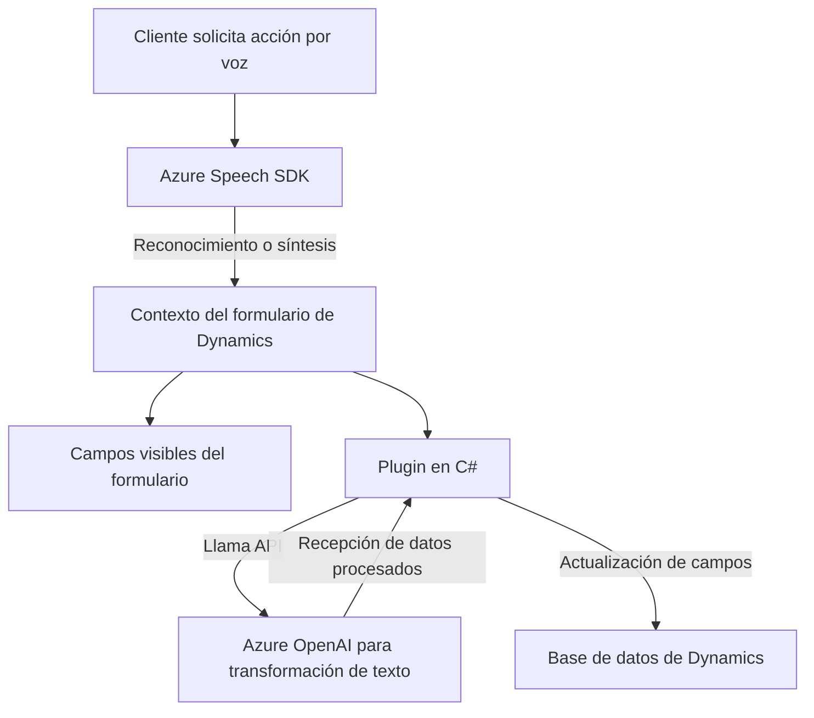

### Breve resumen técnico
El repositorio contiene tres archivos principales (dos frontend basados en JavaScript y un backend basado en C# para Dynamics CRM). Su objetivo es integrar tecnologías como reconocimiento de voz y procesamiento de lenguaje natural (NLP) mediante el **Azure Cognitive Services Speech SDK** y **Azure OpenAI Service** para mejorar la interacción con formularios dinámicos.

---

### Descripción de arquitectura
La solución utiliza una arquitectura modular orientada al servicio:
1. **Frontend**:
   - **Event-driven architecture**: La interacción con los formularios se desencadena mediante eventos, como el uso de entrada de voz o lectura de datos visibles en el formulario.
   - **Modular architecture**: Los scripts están altamente desacoplados, con funciones especializadas para tareas específicas como reconocimiento de voz, síntesis, y manipulación de campos.
   - **Integration architecture**: Se une con Dynamics 365 y APIs externas de Azure AI para complementarse con funcionalidades inteligentes.

2. **Backend**:
   - **Plugin-based architecture**: El componente C# sigue el patrón de plugins de Dynamics CRM, permitiendo la adición de capacidades específicas sin alterar el núcleo del sistema CRM.
   - **Service-oriented architecture (SOA)**: El plugin interactúa con Azure OpenAI Service mediante solicitudes HTTP REST para procesamiento de lenguaje natural.

3. **General**:
   - El sistema sigue un enfoque híbrido que incorpora tecnologías cloud y capacidades locales (browser-side SDKs). Gracias a su diseño modular y orientado a servicios, esta arquitectura puede ser considerada como **n capas**, donde las responsabilidades están claras entre presentación (frontend), lógica de negocio en el plugin y servicios externos en la capa adicional de Azure.

---

### Tecnologías usadas
1. **Frontend**:
   - **JavaScript**: Lenguaje principal para completar las operaciones en el cliente.
   - **Azure Cognitive Services Speech SDK**: Reconocimiento y síntesis de voz.
   - **Dynamics 365 Web API**: Interacción directa con el CRM para manipulación y consulta de datos.
   - **Browser and DOM manipulation**: Carga dinámica de SDK y manejo del formulario.
   
2. **Backend**:
   - **C# (.NET Framework)**: Para extensibilidad basada en plugins.
   - **Azure OpenAI Service**: Procesamiento de lenguaje natural.
   - **Newtonsoft.Json y System.Text.Json**: Manejo de objetos JSON.
   - **HTTP Requests**: Para interacción directa con APIs externas.
   - **Dynamics CRM Plugin Framework**: Estandarización de implementación para complementos.

---

### Diagrama Mermaid válido para GitHub

---

### Conclusión final
El repositorio presenta una solución que conecta entornos Dynamics 365 con tecnologías avanzadas como reconocimiento de voz y procesamiento de texto natural, utilizando Azure Cognitive Services y OpenAI. El enfoque de integración de servicios externos, la separación de responsabilidades, y el uso modular de funciones, revela una arquitectura flexible n capas preparada para la escalabilidad y extensión. 

Sin embargo, se identifican áreas de mejora como seguridad (gestión de claves API) y manejo más robusto de errores. También sería recomendable añadir pruebas unitarias y documentar configuraciones específicas para Azure.