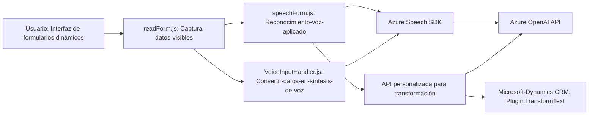

### Breve Resumen Técnico:

El repositorio muestra una solución diseñada para la integración entre una interfaz dinámica de usuario basada en formularios y servicios avanzados de reconocimiento de voz y procesamiento de texto proporcionados por Azure Speech SDK y Azure OpenAI. Está orientada a sistemas como Microsoft Dynamics CRM. La solución incluye funcionalidades de síntesis y reconocimiento de voz, así como la manipulación de datos de formularios y integración con APIs externas.

---

### Descripción de Arquitectura:

1. **Tipo de solución**: Híbrida
   - Frontend: Está diseñado para usarse en interfaces de usuario dinámicas, con módulos orientados a servicios (captura de datos, reconocimiento y síntesis de voz).
   - Backend: Plugin para Dynamics que procesa lógica relacionada con Azure OpenAI.
   - API personalizada: Usada para transformar datos desde Azure OpenAI.
   
2. **Arquitectura general**:  
   - **Cliente/Servidor en n-capas**
     - En el frontend, los scripts se organizan en lógica orientada a eventos y servicios.  
     - El backend está implementado como un servicio modular (plugin Dynamics), enfocado en transformación de datos y llamada a APIs externas.   
   - Modularidad notable en las características: cada archivo actúa en responsabilidades específicas (captura, reconocimiento, síntesis, transformación).

3. **Interacción Cliente/Servidor**:
   - **Eventos**: El frontend opera bajo un patrón event-driven para iniciar funciones de reconocimiento de voz, síntesis y mapeo de datos.  
   - **Integración con APIs**: Uso de SDK (Azure Speech y OpenAI) para realizar tareas de procesamiento y reconocimiento.  
   - **Dependencia dinámica**: La solución asegura de forma programática que SDKs externos sean cargados en tiempo de ejecución.

---

### Tecnologías y Patrones usados:

1. **En el Frontend**:
   - **Azure Speech SDK**: Reconocimiento y síntesis de texto a voz.
   - **Event-driven**: Uso de callbacks y asincronía para procesos del SDK y APIs externas.
   - **Modularidad**: Las funciones están distribuidas e implementan el principio de responsabilidad única. 
   - **Data Mapping**: Procesamiento de datos estructurados para realizar mapeo entre campos de formularios y entradas/salidas reconocidas o transformadas.

2. **En el Backend**:
   - **Microsoft Dynamics CRM SDK `IPlugin`**: Seguimiento del patrón de plugin en escenarios Dynamics CRM para eventos específicos.
   - **Azure OpenAI API**: Transformación avanzada de texto según reglas definidas en el backend.
   - **Libraries**:
     - `System.Net.Http` para solicitudes HTTP.
     - JSON handling (via `System.Text.Json` y `Newtonsoft.Json.Linq`).

---

### Dependencias o Componentes Externos:

1. **Azure Speech SDK**:
   - Servicio de síntesis de voz y reconocimiento conectado al frontend para capturar datos a través de comandos de voz y generar audio de salida.  
   - Es cargado dinámicamente mediante funciones como `ensureSpeechSDKLoaded`.
   
2. **Azure OpenAI**:
   - Servicio usado en el backend plugin para manipulación avanzada de texto mediante reglas configuradas.  
   - Realiza transformaciones semánticas en JSON para integración directa con formularios.

3. **API personalizada**:
   - Llamada dinámica desde el frontend para consultar y procesar datos (posiblemente delegando tareas hacia Azure OpenAI).  

4. **Microsoft Dynamics CRM SDK**:
   - Base de creación del plugin que maneja eventos de sistema relacionados con procesamiento de texto y sincronización con almacenamiento de datos.

5. **Xrm.WebApi**:
   - Librería de Dynamics para manipulación directa de la base de datos CRM a través de las funciones implementadas.

---

### Diagrama Mermaid:

---

### Conclusión Final:

Esta solución está orientada a una **interacción fluida entre cliente y servicio**, con una arquitectura en **n-capas** destinada a facilitar la integración entre el sistema Microsoft Dynamics CRM, Azure OpenAI, y Azure Speech SDK. Implementa patrones orientados a eventos y modularidad, considerando la interoperabilidad con sistemas externos y la adaptación dinámica del SDK en el cliente.