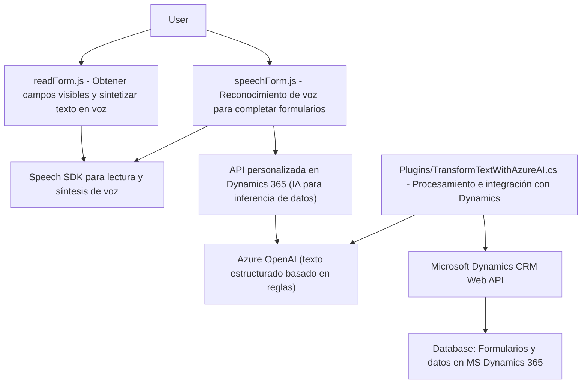

### Breve resumen técnico

El repositorio presenta una solución híbrida que combina frontend en JavaScript con funciones avanzadas de reconocimiento de voz, procesamiento de texto y síntesis de audio mediante **Azure Speech SDK**, integrados con formularios dinámicos. Además, incluye un plugin en C# para **Microsoft Dynamics 365**, que utiliza **Azure OpenAI** para la transformación avanzada de datos mediante reglas específicas. Destaca por tratar datos de formularios (front) y servicios cloud externos (voz e IA).

---

### Descripción de arquitectura

La solución cuenta con una arquitectura **modular**, distribuida en tres capas:

1. **Frontend (JS)**:
   - Se encarga de la interacción directa con el usuario usando voz y formularios. Implementa lógicas de reconocimiento de voz, síntesis de texto y procesamiento de datos relacionados con los formularios. Depende de Azure Speech SDK para estas funciones.

2. **Integración API (plugins en C#)**:
   - Implementa un plugin en Dynamics 365 para delegar el procesamiento avanzado de datos a la API de Azure OpenAI, donde el texto es transformado de forma estructurada y retornado como JSON para su uso en el sistema.

3. **Servicios externos (Azure)**:
   - Usa servicios de **Azure Speech SDK** para la síntesis de voz y reconocimiento de voz.
   - Usa **Azure OpenAI API** para procesamiento de texto basado en IA avanzada.

Este tipo de arquitectura puede clasificarse como **multicapas**, donde el frontend realiza las operaciones de entrada de usuario y se comunica con servicios backend o API externas para funciones avanzadas. La integración en Dynamics 365 utiliza un enfoque **plugin-based architecture**, que desacopla la lógica del CRM de las externas.

---

### Tecnologías usadas

1. **Frontend**:
   - **JavaScript ES6+**: Base del desarrollo del cliente, organiza la lógica en funciones modulares.
   - **Azure Speech SDK**: Biblioteca para síntesis de voz, generación y reconocimiento de texto.
   - **Microsoft Dynamics 365 JavaScript API**: Usado en operaciones con formularios.

2. **Backend**:
   - **C#**: Implementación del plugin en Dynamics 365.
   - **Azure OpenAI Service**: Procesa texto mediante IA en servicios de "completions".

3. **General**:
   - **HTTP/REST**: Para integración con Azure OpenAI y otros servicios externos.
   - **JSON** y **System.Text.Json**: Para estructuración y procesamiento de las respuestas de API.

4. **Patrones arquitectónicos**:
   - Modularidad funcional (JS).
   - Event-driven para manejo de grabación y reconocimiento.
   - Desacoplamiento mediante servicios cloud (voz e IA).

---

### Dependencias o componentes externos

1. **Azure Speech SDK**: Reconocimiento de voz y síntesis.
2. **Microsoft Dynamics 365 Web API**: Lectura y asignación de valores en formularios.
3. **Azure OpenAI**:
   - Dependencias para llamadas HTTP:
     - `System.Net.Http`, `Newtonsoft.Json`, `System.Text.Json`.
   - Clave API: Elemento sensible, recomendado usar sistemas de gestión de secretos.
4. **Otros**:
   - Servicios externos para la carga dinámica del SDK y otras funciones de la interacción con Azure.

---

### Diagrama Mermaid

---

### Conclusión final

La solución integra una arquitectura **modular de múltiples capas**, que combina interacción frontend basada en JavaScript y servicios avanzados de procesamiento en la nube (Azure Speech SDK y Azure OpenAI). La implementación es moderna y orientada a eventos, con una integración estratégica mediante plugins y APIs en Dynamics 365.

**Puntos fuertes**:
- Uso de servicios avanzados en el frontend.
- Modularidad bien diseñada.
- Integración del reconocimiento de voz con datos del formulario.
  
**Áreas de mejora**:
- Gestión de claves sensibles para Azure OpenAI en el plugin de C#.
- Mejor manejo de errores en interacción externa (API/Speech SDK).  
