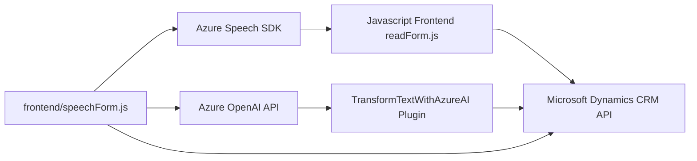

### Breve resumen técnico
El repositorio implementa un conjunto de soluciones para la interacción con Microsoft Dynamics CRM usando Azure Speech SDK y Azure OpenAI. Estas soluciones facilitan la integración de servicios de reconocimiento de voz, transformación de texto a voz, reconocimiento sobre formularios, y generación de texto usando inteligencia artificial.

---

### Descripción de arquitectura
**Los tres archivos analizados comparten una arquitectura distribuida** orientada a la integración de herramientas externas y sistemas CRM, centrándose principalmente en la interacción con APIs de Azure y Microsoft Dynamics 365 mediante enfoques desacoplados y modulares.

1. **Frontend/JS/readForm.js** y **Frontend/JS/speechForm.js**:
   Estas implementaciones presentan una arquitectura de cliente que opera en un sistema bidireccional de integración API entre el cliente y los servicios externos (como Azure Speech SDK y Dynamics 365 API). Este software funciona como una capa de interacción directa con los usuarios para la captura y procesamiento de datos relacionados con formularios, en un contexto MVC (Modelo-Vista-Controlador).

2. **Plugins/TransformTextWithAzureAI.cs**:
   Este archivo sigue la arquitectura de **Plugin de Dynamics CRM**, lo que le permite integrarse y ejecutarse en el servidor de Dynamics como parte de su lógica empresarial personalizada. El procesamiento principal de este componente se delega a un servicio de nube externo (Azure OpenAI API), lo que refuerza su diseño orientado a microservicios para realizar transformaciones mediante AI.

### Tecnologías usadas
1. **Azure Speech SDK**:
   - Capacidad de síntesis y reconocimiento de voz.
   - URL de SDK: `https://aka.ms/csspeech/jsbrowserpackageraw`.

2. **Microsoft Dynamics CRM SDK**:
   - CRUD extensivo mediante modelos estándar de Dynamics.
   - Contextos de ejecución para formularios y eventos.

3. **Azure OpenAI API**:
   - Modelo: GPT (usando variantes como `gpt-4o`).
   - Usada para transformar texto mediante IA que sigue reglas específicas.

4. **JavaScript** para integrar funcionalidades del frontend con aplicaciones de Dynamics 365.
5. **C# (.NET Framework)** en el desarrollo de plugins integrados en Dynamics CRM.
6. **Librerías JSON**:
   - **Newtonsoft.Json.Linq** y **System.Text.Json** para el manejo de datos en formato JSON.

### Dependencias o componentes externos presentes
1. **Azure SDKs**:
   - Speech SDK: Interacción directa con APIs de Azure para reconocimiento y síntesis de voz.
   - OpenAI SDK: Implementación de servicios de transformación de texto basados en inteligencia artificial.

2. **Microsoft Dynamics CRM APIs**:
   - Servicios REST/GraphQL utilizados por los archivos JavaScript y el plugin C#.
   - Interacción con Form Context API (`attributes.get()`, `controls.get()`).

3. **JSON Serialization/Deserialization Libraries**:
   Manejo eficiente de datos estructurados con JSON en los plugins C#.

4. **HttpClient (C#)** para comunicación con Azure APIs.

---

### Diagrama validado en formato **Mermaid**

---

### Conclusión final
La solución es un **sistema integrado cliente-servidor** con dos partes bien definidas:
1. **Frontend:** implementado en JavaScript, que interactúa directamente con interfaces de usuario dentro del contexto de Microsoft Dynamics CRM y conecta con el SDK de Azure Speech.
2. **Backend Plugin:** desarrollado en C#, que se ejecuta en el servidor de Dynamics CRM y realiza operaciones avanzadas de integración con la API de Azure OpenAI para la transformación de datos mediante inteligencia artificial.

La arquitectura puede considerarse como una variante híbrida orientada a servicios, aprovechando externalización de procesamiento vía Azure, con patrones desacoplados y modularidad en los componentes internos. Esto permite flexibilidad y escalabilidad mediante la nube.