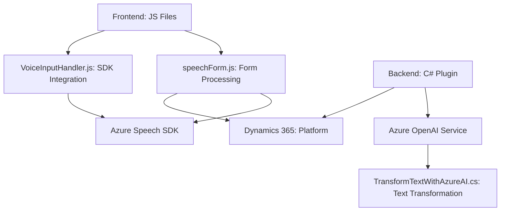

### Breve Resumen Técnico
El repositorio muestra una solución diseñada para la integración de formularios dinámicos en Microsoft Dynamics 365 con funcionalidades avanzadas de voz (mediante Azure Speech SDK) e inteligencia artificial (Azure OpenAI). Además, contiene un plugin que extiende la funcionalidad del CRM para transformar texto aplicando IA. Los archivos proporcionados incluyen un frontend (JavaScript) y un backend en C# bajo Dynamics 365.

---

### Descripción de Arquitectura
La arquitectura sigue el patrón de **n capas**, con una clara separación entre las responsabilidades del frontend y backend:

1. **Frontend**:
    - Componente modular en JavaScript que interactúa con Dynamics 365 y el navegador. Sus funcionalidades giran en torno a integración del SDK de Azure Speech, reconocimiento de voz, síntesis de datos y actualización de formularios.
    - Dependencias externas integradas dinámicamente (Azure Speech SDK).

2. **Backend**:
    - Plugin desarrollado en C# que opera como un microservicio en Dynamics 365.
    - Interactúa con el servicio Azure OpenAI para transformar texto basado en un esquema extendido.

---

### Tecnologías Usadas
1. **Frontend:**
   - Lenguaje: JavaScript.
   - Framework: Dinámico para entornos de Dynamics CRM.
   - Integración: Azure Speech SDK para reconocimiento y síntesis de voz.
   - Backend API: Uso de Custom API de Dynamics 365 para llamadas internas.

2. **Backend Plugin (C#):**
   - Lenguaje: C#.
   - Framework: Dynamics 365 SDK (plugin extensible).
   - Integración: Azure OpenAI vía HTTP POST (usando `System.Net.Http`).
   - JSON Manipulation: `System.Text.Json`.

3. **Patrones generales**:
   - Modularización del frontend mediante funciones aisladas y reutilizables.
   - Encapsulación en el backend para delegar tareas específicas (transformación de texto).
   - Arquitectura orientada a servicios (dependencia de Azure Speech SDK y Azure OpenAI).

---

### Dependencias o Componentes Externos
1. **Frontend:**
   - **Azure Speech SDK**: Para síntesis y reconocimiento de voz.
   - **DOM APIs**: Para manipular elementos del frontend y cargar dinámicamente el SDK.
   - **Dynamics CRM context**: Proporciona datos visibles y actualiza el formulario.

2. **Backend Plugin:**
   - **Azure OpenAI Service**: Para personalizar y transformar texto según las normas especificadas.
   - **HTTP Client**: Para consumir APIs REST externas.
   - **Dynamics 365 SDK**: Para manipulación del contexto CRM.

---

### Diagrama Mermaid

---

### Conclusión Final
El repositorio representa una solución híbrida orientada a **Dynamics 365 customizations** con soporte para interacción por voz y procesamiento avanzado basado en AI. Su arquitectura de **n capas** está claramente delimitada entre frontend, backend y servicios externos. Las dependencias principales (Azure Speech y OpenAI) fortalecen su funcionalidad mediante API integraciones. La modularidad del código es adecuada, aunque algunas importaciones redundantes pueden optimizarse. Además, la gestión de secretos y configuración podría mejorarse en el backend.