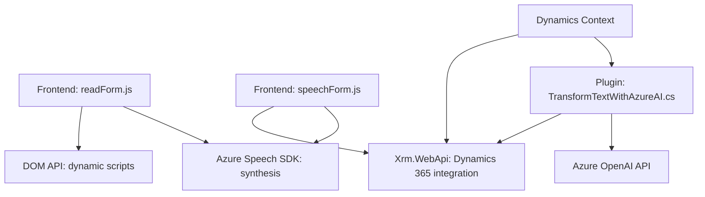

### Breve resumen técnico
El repositorio contiene varias herramientas implementadas con tecnologías frontend, backend y plugins para Dynamics 365 CRM. Estas trabajan en conjunto para procesar formularios, integrar reconocimiento de voz y generación de datos estructurados mediante IA (Azure Speech SDK y Azure OpenAI).

### Descripción de arquitectura
La solución es un híbrido de arquitectura **modular** y **n capas**:
- **Frontend:** Interactividad en el navegador con voz y mapeo de formularios.
- **Backend (Plugins):** Operaciones personalizadas y procesamiento de datos mediante Dynamics CRM y Azure OpenAI.
- **Patrón de integración:** Comunicación entre capas y dependencias externas (Azure Speech SDK, Dynamics CRM, OpenAI).

### Tecnologías usadas
1. **Frontend:**
   - **JavaScript:** Para manejar formularios y reconocimiento de voz.
   - **Azure Speech SDK:** Procesamiento y síntesis de voz.
2. **Backend:**
   - **C# .NET**: Desarrollo del plugin para Dynamics CRM.
   - **Microsoft Dynamics 365 SDK:** Integración directa con el sistema CRM.
   - **Azure OpenAI:** Generación dinámica de respuestas JSON basadas en texto.
3. **Dependencias:**
   - `Newtonsoft.Json`, `System.Net.Http`, `System.Text.Json`: Manejo de datos y API en C#.
   - `DOM API`: Manipulación de scripts cargados dinámicamente en navegador.

### Diagrama Mermaid válido

### Conclusión final
La solución ofrece una implementación de **interactividad enriquecida** para formularios utilizando síntesis y reconocimiento de voz, además de procesamiento avanzando de texto con IA integrada. A nivel arquitectónico, el enfoque modular asegura la separación de responsabilidades y flexibilidad para integrar servicios externos como Azure Speech SDK, Dynamics APIs y Azure OpenAI. El diseño prioriza la accesibilidad y la integración con sistemas empresariales relevantes.