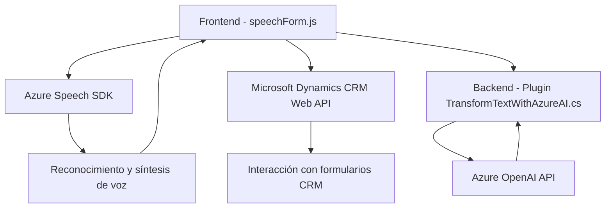

### Breve Resumen Técnico
El repositorio contiene componentes orientados al procesamiento de formularios mediante entrada y salida de voz, integrándose con servicios como **Microsoft Dynamics CRM**, **Azure Speech SDK**, y **Azure OpenAI**. La solución incluye módulos frontend en JavaScript para interacción con usuarios y un plugin backend en C# para transformación de datos mediante inteligencia artificial.

---

### Descripción de Arquitectura
La arquitectura es híbrida. A nivel frontend, adopta una estructura en capas donde las funciones cliente están organizadas en módulos independientes que interactúan con servicios externos (Azure y Dynamics CRM). En el backend (C#), se utiliza un diseño clásico de plugins que dependen de APIs externas para procesamiento avanzado. En general, es una **arquitectura n-capas** con integración a servicios externos.

---

### Tecnologías Usadas
1. **Frontend:**
   - **JavaScript** (para procesamiento de voz y manipulación de formularios).
   - **Azure Speech SDK** (reconocimiento y síntesis de voz).
   - **Microsoft Dynamics CRM Web API** (interacción con formularios y entidades del CRM).
   - **Lógica IA** integrada mediante APIs personalizadas.

2. **Backend:**
   - **C# y .NET Framework** (implementación del plugin de Dynamics).
   - **Azure OpenAI API** (análisis de texto usando modelos GPT).
   - **Newtonsoft.Json** (manipulación avanzada de JSON).
   - **Dynamics CRM SDK** (estructura y objeto principal del plugin).

3. **Patrones de Diseño:**
   - Modularización para separación lógica.
   - Delegación y callbacks para carga dinámica (Azure Speech SDK).
   - Mapping dinámico de datos de formularios.
   - Comunicación basada en servicios (API externa: Azure OpenAI).

---

### Diagrama Mermaid de la Arquitectura

---

### Conclusión Final
La solución presentada integra tecnologías modernas para procesar datos de texto y voz en formularios interactivos con capacidades avanzadas de IA. El diseño modular y las dependencias externas (Azure SDKs y Dynamics CRM API) permiten flexibilidad y extensibilidad. Sin embargo, el sistema tiene varios puntos críticos, como la dependencia directa de claves estáticas y de servicios externos, que podrían mejorar adoptando prácticas como el almacenamiento seguro de credenciales. El diagrama Mermaid valida la comunicación fluida entre sus componentes.