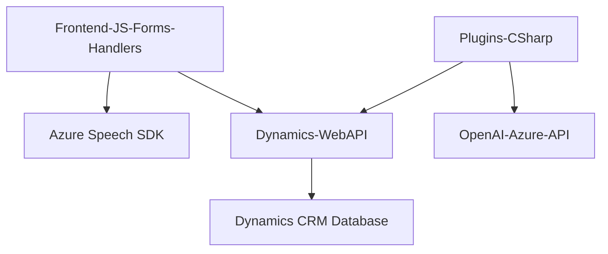

### 🔍 Breve resumen técnico:

El repositorio contiene una solución destinada a implementar un sistema de entrada y salida por comando de voz, orientado específicamente a operar con formularios de Microsoft Dynamics 365. La solución emplea integración con servicios externos como **Azure Speech SDK** y **Azure OpenAI**, para procesar voz y texto. El marco de trabajo principal es Dynamics 365, con conexiones hacia APIs personalizadas y bibliotecas externas. La arquitectura utiliza un enfoque modular complementado por patrones como integración de servicios externos y adaptadores.

---

### 🏛️ Descripción de la arquitectura:

- **Tipo de solución:**  
  La solución puede clasificarse como un sistema híbrido que interactúa con **APIs (Azure Speech SDK, OpenAI)**, procesa datos del **frontend (JavaScript)** y combina lógica basada en **plugins para Dynamics CRM**.

- **Tipo de arquitectura:**  
  La arquitectura tiene un enfoque basado en **n capas** y parcial **orientación a servicios**:
  - **Presencia n capas:** Cada parte del sistema cumple roles propios, como interfaz (frontend), lógica de negocio (Dynamics), y acceso a datos (mediante APIs de servicio).  
  - **Presencia SOA:** El sistema se conecta a servicios externos (**Azure Speech SDK y Azure OpenAI**) para realizar tareas específicas (reconocimiento de voz, transformación de texto).  
  - No es microservicios ni hexagonal ya que depende de un núcleo monolítico de Dynamics CRM.

### ⚙️ Tecnologías usadas:

1. **Lenguajes y Frameworks:**
   - *Frontend:* JavaScript para lógica de formularios.
   - *Backend/Plugins:* Microsoft C# integrado con Dynamics 365.

2. **Librerías y SDKs:**
   - Azure Speech SDK (JavaScript client library for Browser).
   - Azure OpenAI (HTTP REST API).
   - Newtonsoft.Json (manejo avanzado de objetos JSON en C#).

3. **Plataforma y servicios:**
   - Dynamics CRM (Microsoft Xrm SDK) para desarrollo de formularios, integración de datos y plugins.
   - External APIs for Azure services.

4. **Patrones:**
   - **Modular Programming:** Código en el frontend estructurado en funciones con responsabilidades específicas y reutilizables.
   - **Lazy Loading:** El SDK de Azure Speech se carga dinámicamente solo cuando es necesario.
   - **Service Integration:** Interacciones directas con Azure Speech SDK y Azure AI.
   - **Adapter Pattern:** Transformación y mapeo JSON y valores legibles en Dynamics 365.
   - **Event-Driven:** Uso de asincronía en funciones como el reconocimiento por voz o procesamiento de API.

---

### 👉 Dependencias o componentes externos posiblemente presentes:

1. **Azure Speech SDK:** Para reconocimiento de voz/síntesis en `readForm.js` y `speechForm.js`.  
   - URL referida: https://aka.ms/csspeech/jsbrowserpackageraw  

2. **Dynamics 365 Web APIs:** Para manipulación JSON, formularios, y atribuciones en `speechForm.js`.  

3. **Azure OpenAI API:** Para procesamiento de texto avanzado basado en IA en el plugin `TransformTextWithAzureAI.cs`.  
   - Integración realizada vía HTTP con posible autenticación mediante claves.  

4. **Frontend integrations:** Del navegador, como el manejo de elementos HTML y APIs de navegador nativas (`window`, `document`).

5. **C# dependencies:** Namespace `System.Net.Http` y `Newtonsoft.Json.Linq` para la manipulación JSON y solicitudes API en `TransformTextWithAzureAI.cs`.

---

### 📊 Diagrama Mermaid estructural:

---

### 🔚 Conclusión final:

El repositorio implementa una solución funcional que aprovecha las capacidades de **Azure Speech SDK** y **Azure OpenAI** para mejorar la accesibilidad y procesamiento inteligente de datos en formularios de Dynamics 365. La solución tiene una arquitectura n capas con una inclinación hacia SOA, dado su uso intensivo de servicios externos. Además, presenta una modularidad bien definida en su diseño interno.  

Aunque funcional, la integración de lógica de formulario y reconocimiento de voz en el frontend e integración de servicios externos/IA en los plugins podría beneficiarse de una refactorización, promoviendo una mayor separación de responsabilidades para facilitar la escalabilidad y el mantenimiento.