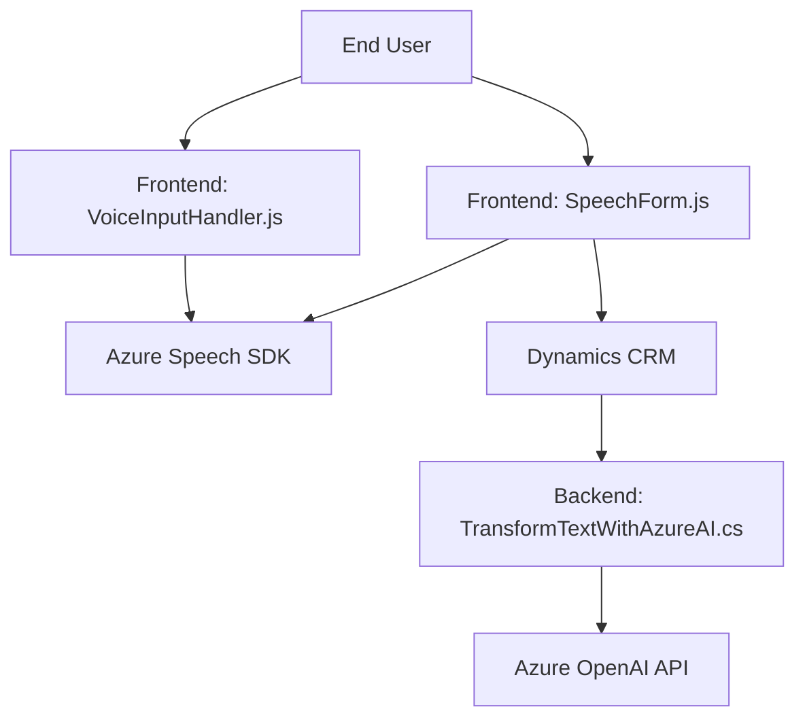

### Análisis técnico del proyecto

#### 1. Breve resumen técnico
El proyecto presenta una integración multiplataforma que combina un frontend JavaScript, lógica personalizada (mediante plugins) y uso de servicios en la nube (Azure Speech SDK y Azure OpenAI). El objetivo principal es optimizar la interacción con formularios dinámicos en entornos CRM, procesando datos textuales mediante reconocimiento de voz y procesamiento avanzado de texto via IA.

#### 2. Descripción de arquitectura
La arquitectura de esta solución se caracteriza por las siguientes capas y patrones:
- **Frontend:** Implementado en JavaScript, utiliza módulos para cargar dinámicamente el SDK de Azure, procesar datos y realizar actualizaciones en un CRM.
- **Backend:** Se implementa como plugins para Dynamics CRM en C#, con comunicación directa con servicios Azure para procesamiento IA y transformación de texto.
- **Servicios externos:** Azure Speech SDK y Azure OpenAI se integran para funcionalidad avanzada, siendo consumidos desde el frontend y backend, respectivamente.
- **Monolitismo en almacenamiento:** Dynamics CRM actúa como sistema central, pero con extensibilidad mediante plugins orientados a tareas específicas.

En términos generales, la arquitectura combina el modelo **n-capas** (donde el frontend y plugins interactúan de forma dependiente) con elementos de **arquitectura hexagonal (Ports & Adapters)** en la integración externa con servicios de Azure.

#### 3. Tecnologías usadas
- **Frontend:**
  - Lenguaje: JavaScript.
  - SDK: Azure Speech SDK para procesamiento del texto a voz y reconocimiento de voz.
  - Framework de CRM: Posible uso de Dynamics CRM basado en interacción con `executionContext`.
  - Comunicación con APIs personalizadas del CRM.
  
- **Backend:**
  - Lenguaje: C# basado en .NET Framework para plugins.
  - Servicio externo: Azure OpenAI API (GPT-4).
  - Librerías: `Newtonsoft.Json` para manipulación JSON y `System.Net.Http` para solicitudes HTTP.
  - Aplicación extendida: Dynamics CRM.

#### 4. Dependencias o componentes externos
- **Azure Speech SDK:** Utilizado en el frontend para reconocimiento de voz y síntesis de texto con voz.
- **Azure OpenAI API:** Utilizado en el backend para procesamiento avanzado de texto.
- **Microsoft Dynamics CRM SDK:** Para extensibilidad mediante plugins personalizados.
- **APIs personalizadas:** Plugins y el frontend interactúan con APIs específicas del sistema CRM.

---

### Diagrama Mermaid

---

### Conclusión final
Este proyecto es una solución híbrida diseñada para sistemas CRM con integración avanzada de tecnologías de voz e inteligencia artificial. Está orientado a mejorar la experiencia de usuario mediante interacción natural y procesamiento automatizado de datos. Aunque su arquitectura es mayormente dependiente de un sistema centralizado (Dynamics CRM), la integración con servicios externos (Azure SDKs) y APIs personalizadas le brinda cierta modularidad y adaptabilidad. La elección de tecnologías modernas como Azure OpenAI demuestra un enfoque hacia capacidades avanzadas y escalabilidad futura.