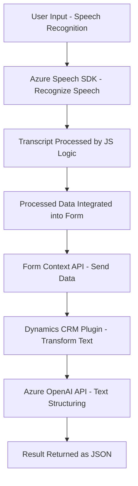

### **Breve Resumen Técnico**

El repositorio parece implementar una solución que integra reconocimiento de voz, síntesis de texto a voz, interacción dinámica con formularios en una interfaz de usuario, y un plugin para transformar datos mediante Azure OpenAI. Está compuesto por varios componentes independientes que trabajan juntos:

- **Frontend (JavaScript):** Gestión de voz (reconocimiento y síntesis), utilizando SDKs como Azure Speech y APIs externas.
- **Backend (C# Plugin):** Servicio integrado con Microsoft Dynamics CRM que transforma texto mediante reglas predefinidas utilizando Azure OpenAI.
- **Cloud Services:** Integración directa con APIs de Azure Speech y Azure OpenAI para procesos de voz e inteligencia artificial.

---

### **Descripción de Arquitectura**

La solución adopta una **arquitectura distribuida** con dos niveles principales:
1. **Frontend acoplado al cliente (navegador):** Se conecta directamente a los servicios de Azure Speech para reconocimiento y síntesis de voz mediante SDKs, con interacción en tiempo real.
2. **Backend basado en plugins y API:** Funciona como extensión del Microsoft Dynamics CRM, integrando servicios cloud mediante llamadas REST.

El sistema no parece ser un monolito, ya que las funciones están distribuidas entre frontend, backend, y servicios cloud. Aunque podría considerarse de **n capas**, la solución parece transitar a una **arquitectura orientada a servicios** con componentes asincrónicos y modulares.

---

### **Tecnologías Usadas**

1. **Frontend:**
   - **JavaScript:** Para lógica de reconocimiento y síntesis de voz, y manejo del DOM.
   - **Azure Speech SDK:** Gestión de entrada y salida de voz.
   - **Microsoft Dynamics Form Context APIs:** Manipulación de formularios.

2. **Backend:**
   - **C# Plugin (Dynamics CRM):** Extensión que transforma texto con Azure OpenAI mediante HTTP y REST.
   - **Azure OpenAI API:** Procesamiento de texto estructurado con IA.
   - **Microsoft.Xrm.Sdk** y **Newtonsoft.Json:** Manejo del contexto CRM y datos JSON.

3. **Arquitectura:**
   - **Modularización:** Funciones específicas para cada tarea como extracción, transcripción, mapeo y extensión del CRM.
   - **Patrón Event-driven:** Uso de eventos en plugins y callbacks para SDK dinámico.

---

### **Dependencias o Componentes Externos**

- **Azure Speech SDK:** Reconocimiento y síntesis de voz.
- **Microsoft Dynamics SDK:** Gestión del contexto en formularios y plugins.
- **Azure OpenAI API:** Transformación de texto con IA.
- **Newtonsoft.Json y System.Net.Http:** Procesamiento de datos JSON y llamadas REST.
- **DOM API:** Para manipular los formularios y contextos en el frontend.

---

### **Diagrama Mermaid 100 % Compatible**

Aquí está el diagrama mermaid explicando el flujo lógico entre los componentes:

---

### **Conclusión Final**

Esta solución engloba una arquitectura híbrida que combina frontend interactivo con servicios cloud de tiempo real, y plugins extensibles integrados en CRM. El uso de SDKs como Azure Speech facilita la manipulación de voz en el frontend, mientras que la Azure OpenAI API potencia el procesamiento de texto y reglas desde el backend. La orientación modular y asincrónica sugiere escalabilidad y separación clara de responsabilidades.