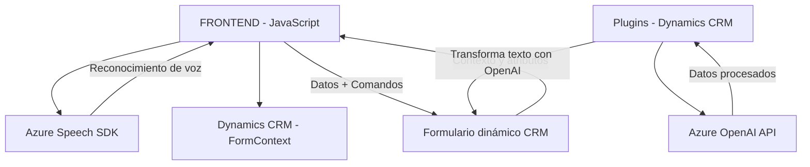

### Breve resumen técnico:
El repositorio presenta una solución que integra reconocimiento y síntesis de voz (Azure Speech SDK) con Microsoft Dynamics CRM para interactuar con formularios utilizando comandos hablados, además de un plugin que emplea la API de Azure OpenAI para transformar texto dinámico. Esto permite una experiencia optimizada y automatizada para la gestión de datos en aplicaciones empresariales.

---

### Descripción de arquitectura:
1. **Tipo de solución:**  
   - El proyecto comprende una combinación de **frontend manejado por JavaScript** (interactuando con Azure Speech SDK y formularios) y **backend basado en plugins de Dynamics CRM** implementados en C#. Juntos forman una solución integral para reconocimiento de voz y procesamiento de texto avanzado con AI.

2. **Arquitectura:**  
   - **Híbrida**. La solución combina **n-capas** (plugin backend de CRM) y una **arquitectura modular** en el frontend. No se requiere un servidor dedicado porque las actividades se ejecutan como parte de Dynamics CRM y en el navegador.

3. **Componentes clave:**  
   - **Frontend:**
     - Modularidad clara con funciones independientes para tareas específicas (obtención de datos del formulario, síntesis de voz, reconocimiento de voz).  
   - **Backend:**
     - Plugin extensible que encapsula la comunicación con la API OpenAI y la lógica de transformación de texto.  

4. **Tecnologías usadas:**  
   - **Frontend:** 
     - JavaScript.
     - Azure Speech SDK.  
   - **Backend:**  
     - C# para plugins.  
     - Azure OpenAI API para procesamiento de texto.  
     - JSON para comunicación entre componentes.  
     - Microsoft Dynamics CRM SDK para interacción directa con funcionalidades del CRM.  
   - **Patrones arquitectónicos:**  
     - **Facade Pattern** para agrupar llamadas complejas del Speech SDK.
     - Modularidad estructural en el frontend (diseño funcional).  
     - **Plugin extensible** implementando interfaces estándar `IPlugin` en Dynamics CRM.
     - **Integración con APIs externas** (Speech SDK, OpenAI).

---

### Dependencias o componentes externos:
1. **Azure Speech SDK:** Para reconocimiento y síntesis de voz.
2. **Azure OpenAI API:** Para transformación avanzada de texto mediante AI.
3. **Microsoft Dynamics CRM SDK:** Para manipulación de formularios y ejecución de plugins dentro de la plataforma CRM.
4. **JSON Frameworks:**
   - `Newtonsoft.Json` y `System.Text.Json` para la serialización y manejo de estructuras JSON.
5. **HTTP Libraries:** Para el manejo de solicitudes HTTP hacia la API de Azure OpenAI.

---

### Diagrama **Mermaid** 100% compatible con **GitHub Markdown**:

---

### Conclusión final:
El repositorio combina entrada de voz (Azure Speech SDK), transformación de texto por IA (Azure OpenAI) y manipulación de formularios mediante Microsoft Dynamics CRM. Se basa en una arquitectura modular y extensible, permitiendo interacción dinámica entre el usuario y los formularios del CRM a través de voz y texto procesados. La implementación alberga patrones como **Facade** y **Plugin extensible**, promoviendo la simplicidad en la integración con APIs y escalabilidad para adaptar nuevas funcionalidades. Perfecta para automatización de tareas en aplicaciones empresariales.