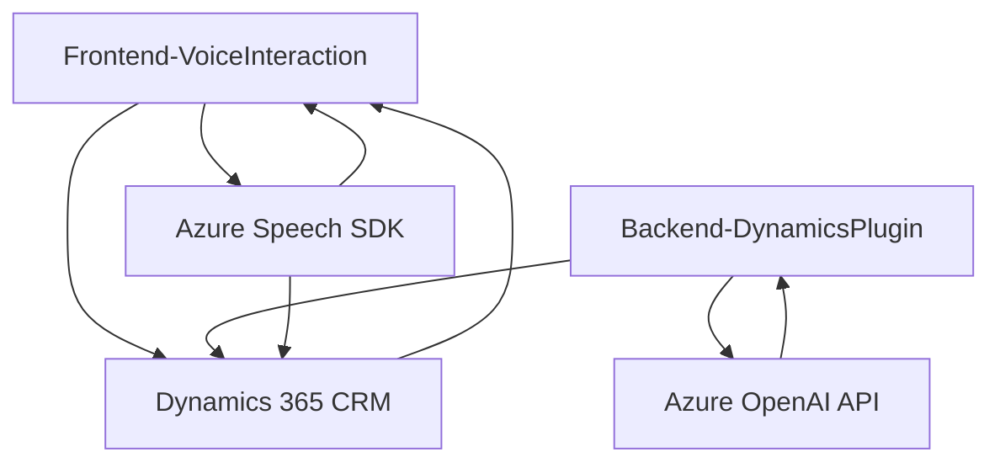

### Breve resumen técnico

Este repositorio se enfoca en soluciones integradas destinadas a mejorar la experiencia del usuario mediante el uso de tecnologías de voz y procesamiento de lenguaje natural. Los archivos proporcionados implementan funcionalidad para síntesis y reconocimiento de voz, así como transformación de texto, aprovechando servicios de Microsoft Azure.

---

### Descripción de arquitectura

1. **Tipo de solución:** 
   - Este repositorio representa una solución híbrida que incluye:
     - **Frontend (JavaScript)** para interacción con formularios y síntesis/reconocimiento de voz.
     - **Plugins (C#)** ejecutados en el backend de Dynamics 365 para procesamiento avanzado de texto mediante Azure OpenAI.
   
2. **Arquitectura:**
   - El proyecto sigue una arquitectura basada en eventos para el frontend (gestiona interacción de usuario y dependencias externas) y el **Plugin Pattern** en el backend (extiende funcionalidad de Dynamics 365). No sigue una arquitectura monolítica, pero tampoco llega a ser una solución completamente distribuida (microservicios). La arquitectura se puede clasificar como **n capas**, con interacción entre el frontend, CRM, y servicios externos de Azure.

---

### Tecnologías usadas

1. **Frontend (JavaScript):**
   - **Azure Speech SDK:** Para síntesis y reconocimiento de voz.
   - **JavaScript:** Estructuración modular con funciones reutilizables, callbacks y promesas asíncronas.
   - Uso de API REST (llamadas desde funciones como `callCustomApi()`).

2. **Backend (C# Plugin):**
   - **Dynamics 365 SDK (`Microsoft.Xrm.Sdk`)** para desarrollo de plugins personalizados.
   - **Azure OpenAI:** Transformación avanzada de texto mediante AI (por ejemplo, GPT-4).
   - **Newtonsoft.Json:** Manipulación de datos JSON.
   - **HttpClient:** Para comunicación con servicios externos.

3. **Patrones usados:**
   - **Event-Driven Architecture** en el frontend.
   - **Facade Pattern:** Abstracción de interacción con APIs externas (Azure Speech y OpenAI).
   - **Plugin Pattern:** Extensión modular y desacoplada del backend (Dynamics 365).
   - **Proxy/Adapter Pattern:** Adaptación al servicio Azure OpenAI API en el backend.

---

### Componentes externos y dependencias

- **Azure Speech SDK:** Para funciones relacionadas con voz.
- **Azure OpenAI API:** Para procesamiento avanzado de texto en el backend.
- **Dynamics 365 SDK:** Interacción directa con formularios y atributos en CRM.
- **Newtonsoft.Json & System.Text.Json:** Manipulación JSON en el backend.
- **HttpClient:** Comunicación con APIs externas desde el plugin.
- **Xrm.WebApi (Frontend):** Para interactuar con la API interna del CRM.
- URL externo (`https://aka.ms/csspeech/jsbrowserpackageraw`) para cargar dinámicamente el Speech SDK.

---

### Diagrama Mermaid (estructura general)

---

### Conclusión final

Este repositorio es una solución híbrida que integra tecnologías del frontend y el backend con énfasis en servicios de voz y procesamiento de lenguaje natural utilizando plataformas de Microsoft Azure. La arquitectura del proyecto está orientada a la interacción con la plataforma Dynamics 365 para CRM, incluyendo la automatización de tareas mediante API y plugins personalizados. Aunque es modular y extensible, podría mejorarse en términos de seguridad (gestión de credenciales). La elección de herramientas y patrones adecuados asegura una solución robusta y adecuada para aplicaciones empresariales orientadas al usuario en tiempo real.