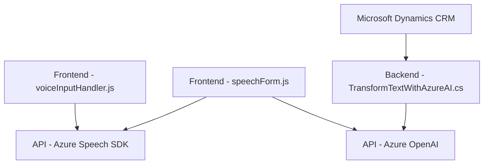

### Breve resumen técnico:
El repositorio expuesto representa una solución integrada para procesamiento de formularios mediante voz y texto. Combina funcionalidades frontend (en JavaScript) con un backend específico (plugin .NET) que se apoya en Azure OpenAI. La solución también demuestra integración con tecnologías de terceros como Dynamics 365 CRM y el Azure Speech SDK.

### Descripción de arquitectura:
La arquitectura de esta solución es modular y basada en integración de servicios. En el frontend, se utiliza un modelo de código estructurado para dividir responsabilidades (análisis del formulario, síntesis y reconocimiento de voz, y API externas). En el backend, se define un plugin en Dynamics CRM que aprovecha un modelo de arquitectura basado en microservicios mediante llamadas REST a Azure OpenAI.

- **Frontend:** Modulares, con un patrón de carga dinámica para cargar el Azure Speech SDK.
- **Backend:** Plugin implementado como un componente que complementa la lógica CRM existente y realiza transformaciones con servicios externos.

A pesar de no ser completamente microservicios por diseño, la solución permite integración con servicios externos mediante APIs REST (Azure Speech y OpenAI), lo que sugiere una **arquitectura híbrida** que combina dependencias locales y externas.

### Tecnologías usadas:
1. **Frontend:**
   - JavaScript (para manipulación DOM y lógica de negocio).
   - Azure Speech SDK (para síntesis y reconocimiento de voz).

2. **Backend:**
   - Dynamics 365 SDK (para manejo del contexto CRM y ejecución de plugins).
   - Azure OpenAI (para transformación de datos y procesamiento con GPT).

3. **Comunicación:**
   - API REST externa para conexión con Azure.

4. **Patrones:**
   - Separación de Concerns: Cada módulo tiene responsabilidades específicas.
   - Modularidad: Funciones desacopladas y reutilizables en frontend.
   - Observer Pattern: Implementación de eventos para activación de operaciones por voz.
   - API Gateway (Dynamics y Azure Speech) para la integración de servicios.

### Diagrama Mermaid (válido para GitHub Markdown):

### Conclusión final:
La solución combina un frontend robusto con lógica distribuida de reconocimiento de voz y procesamiento de texto sobre formularios, que se integra directamente con Microsoft Dynamics CRM y APIs de Azure. Se pueden observar patrones claros de modularidad, separación de responsabilidades e integración con microservicios. Sin embargo, es una arquitectura híbrida, ya que contiene tanto elementos de monolito en el CRM como módulos distribuidos mediante APIs externas (Azure Speech y OpenAI). Esto permite una solución escalable, pero dependerá de los servicios cloud mencionados y del contexto CRM.