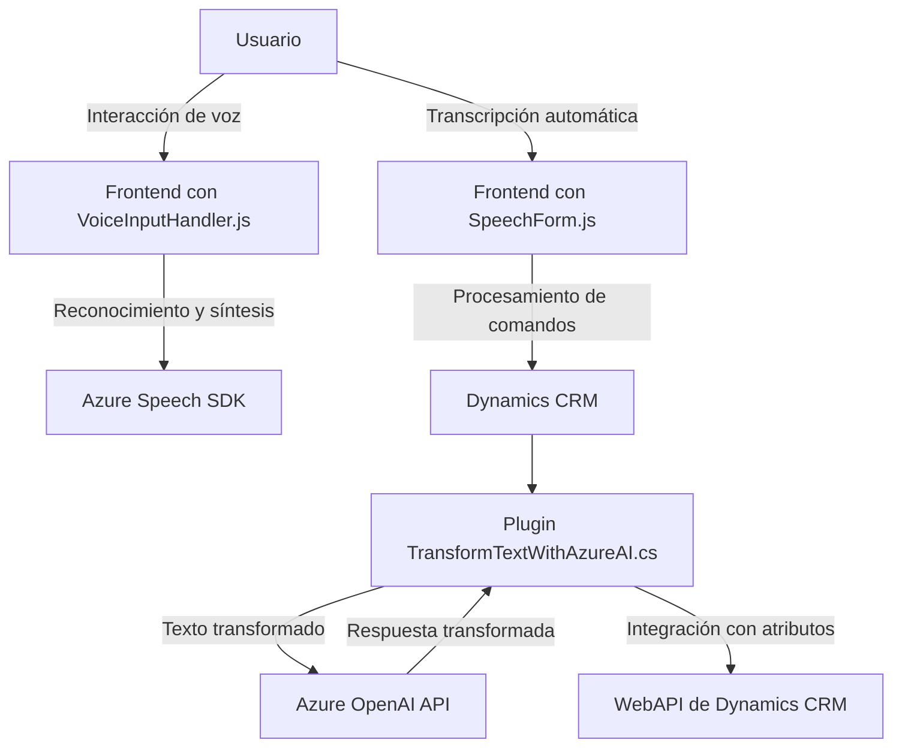

### Breve resumen técnico
Los archivos del repositorio muestran una solución que integra capacidades de reconocimiento de voz, síntesis de voz, procesamiento de texto y manipulación avanzada de formularios, enfocada en accesibilidad y automatización. Utiliza Azure Speech SDK y Azure OpenAI API en una arquitectura orientada a eventos y servicios externos. Esto está estrechamente vinculado a Dynamics CRM, lo que sugiere un sistema corporativo basado en formularios dinámicos.

---

### Descripción de arquitectura
La solución combina tres áreas principales:
1. **Frontend/JS:** Implementa la interacción del usuario mediante reconocimiento y síntesis de voz, con módulos independientes que aprovechan Azure Speech SDK para dinamizar la interacción con formularios.
2. **Backend/Plugins:** Un plugin de Dynamics CRM procesando texto y conectándose a Azure OpenAI API para aplicar transformaciones avanzadas de lenguaje.
3. **Servicios externos:** Azure Speech y Azure OpenAI están integrados como servicios API para facilitar funcionalidades principales.

La arquitectura implementada es principalmente **n-capas**:
1. **Presentación (Frontend/JS):** Control de voz, síntesis de texto a voz y transcripción de comandos.
2. **Lógica de aplicación (Plugins):** Procesamiento de datos de forma descentralizada, incluyendo integraciones con CRM y APIs externas.
3. **Servicios externos:** Uso intensivo de Azure para enriquecer funcionalidades fuera del sistema principal.

En ciertos aspectos, esta solución también muestra componentes de **arquitectura hexagonal**, ya que la lógica de negocio se abstrae mediante interfaces (API externas, SDKs) y plugins que pueden ser reemplazados o extendidos fácilmente.

---

### Tecnologías usadas
1. **Azure Speech SDK:** Reconocimiento de voz y síntesis de texto a voz.
2. **Azure OpenAI API:** Procesamiento del lenguaje natural para transformación avanzada de texto.
3. **Microsoft Dynamics CRM:** Gestión de formularios dinámicos y uso de WebAPI para manipular datos.
4. **JavaScript (Frontend):** Programación asincrónica para interacción UX.
5. **C# (Backend/Plugin):** Implementación de lógica empresarial en el ecosistema CRM.
6. **HTTP:** Comunicaciones con APIs externas mediante peticiones RESTful.

---

### Diagrama Mermaid válido para GitHub

---

### Conclusión final
La solución es un sistema híbrido que integra capacidades avanzadas en accesibilidad y procesamiento de lenguaje en interacción con usuarios. Está bien diseñada para integrarse en ambientes corporativos que utilicen Dynamics CRM y ofrece potencia extendida mediante Azure Speech y Azure OpenAI APIs. La arquitectura n-capas, junto con elementos de flexibilidad hexagonal, permite un fácil escalado y adaptabilidad.