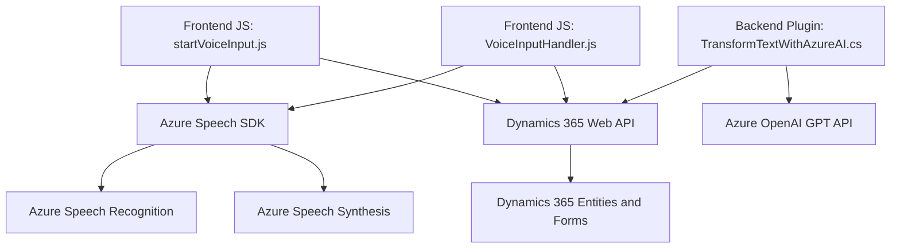

### Breve resumen técnico

El repositorio parece manejar una solución para interactuar con formularios en Dynamics 365. Está diseñado para admitir entrada de voz y salida mediante síntesis de voz, además de integrarse con Azure OpenAI GPT para transformar texto en formatos estructurados como JSON. En general, esta solución implementa módulos frontend desarrollados en JavaScript para integrar Azure Speech SDK con Dynamics 365 y un plugin en C# para interactuar con la API Azure OpenAI.

---

### Descripción de arquitectura

La solución combina múltiples capas y servicios externos:

- **Tipo de solución**: Aplicación backend y frontend integrada con Dynamics 365.
- **Arquitectura**: Tiene un enfoque híbrido de arquitectura:
  - **n capas**: Separación entre frontend (manejo de formularios y voz), backend (Dynamics plugin), y las APIs externas (Azure Speech y Azure OpenAI).
  - **Event-Driven**: Aprovecha eventos como carga dinámica del SDK en JavaScript y reacción a cambios en el contexto de Dynamics CRM.
  - **Microservicios externos**: Dependencia de servicios externos como Azure Speech y Azure OpenAI que funcionan como microservicios para procesamiento de voz y texto basado en IA.
  - **Integración API**: Uso de Dynamics 365 Web API y Azure APIs para realizar procesos centralizados.

---

### Tecnologías usadas

- **Frontend**:
  - **JavaScript**: Scripts personalizados para integración con Dynamics 365 y Azure Speech SDK.
  - **Azure Speech SDK**: Para reconocimiento y síntesis de voz.
  - **Dynamics 365 Web API**: Interacción con los datos del formulario y entidades.

- **Backend**:
  - **C#**: Desarrollo de un plugin basado en Dynamics CRM SDK.
  - **Azure OpenAI GPT (API)**: Transformación de texto en JSON estructurado con IA.

- **Patrones de diseño**:
  - **Callback/Observer Pattern**: Uso de eventos y callbacks en el SDK de Azure Speech para tareas asíncronas.
  - **Plugin Pattern**: Extensión del comportamiento de Dynamics CRM a través de plugins.
  - **Encapsulación Modular**: Separación de funcionalidades específicas en métodos bien definidos.
  - **API Client Pattern**: Interacción con APIs externas utilizando HTTP.

---

### Dependencias o componentes externos

1. **Azure Speech SDK**: Para procesamiento de voz (reconocimiento y síntesis).
2. **Azure OpenAI GPT API**: Para transformar texto en JSON estructurado basándose en IA.
3. **Dynamics 365 Web API**: Para operaciones CRUD sobre datos en formularios y entidades.
4. **Microsoft Dynamics CRM SDK**: SDK utilizado por el plugin para ejecutar operaciones dentro del sistema CRM.
5. **Librerías genéricas**:
   - `System.Net.Http` y `System.Text.Json` (C#) para manejo de solicitudes HTTP y JSON.
   - `Newtonsoft.Json.Linq` para manejo dinámico de estructuras JSON.

---

### Diagrama Mermaid válido

---

### Conclusión final

La solución utiliza una combinación de herramientas potentes para generar una integración robusta entre Dynamics 365 y tecnologías de inteligencia artificial. La arquitectura propuesta es una mezcla de n capas, servicios API externos y un enfoque modular. Esto permite que el sistema sea escalable y reutilizable en aplicaciones que necesiten manejar entrada/salida de voz, procesamiento de texto a través de IA, o interacción directa con Dynamics 365.