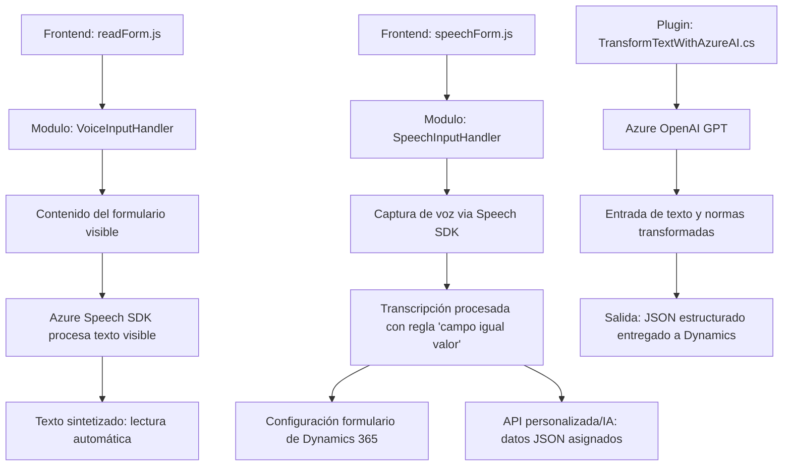

### Breve resumen técnico

El repositorio presenta tres componentes principales:
1. **Archivos de frontend en JavaScript**: Integran la interacción de voz mediante **Azure Speech SDK** con formularios de Dynamics 365, tanto para lectura como escritura de datos.
2. **Plugin en C#**: Desarrollado para Dynamics CRM, usa el modelo GPT de Azure OpenAI para transformar texto de entrada en JSON altamente estructurado según reglas predefinidas.

### Descripción de arquitectura

La arquitectura general corresponde a un ecosistema orientado a servicios con **integración de microservicios focalizados**, donde cada componente cumple un propósito específico al proporcionar funcionalidades a través de APIs o SDKs externos. En el diseño global del sistema, se percibe una aproximación a una arquitectura híbrida: **n Capas** para estructurar lógica y presentación en frontend y **Microservicios** integrados externamente mediante servicios de Azure OpenAI y Dynamics CRM.

- **Frontend**:
  - La solución se enfoca en integrar una interfaz basada en voz, que interactúa directamente con formularios dinámicos mediante funciones específicas encapsuladas.
  - Modularidad de funciones con integración directa del SDK de Azure.
- **Backend (Plugin Dynamics)**:
  - La lógica del plugin implementa dinámicamente funciones basadas en eventos de Dynamics (ej. modificando o verificando datos mientras se actualizan como parte del flujo de trabajo), haciendo uso masivo de servicios de terceros como Azure OpenAI y complementando la arquitectura modular.

### Tecnologías usadas

1. **Frontend:**
   - Tecnología principal: **JavaScript**.
   - Framework: Dynamics CRM Frontend (aplicado en formularios dinámicos).
   - SDK externo: **Azure Speech SDK**.
   - **API REST:** Comunicación con un servicio externo personalizado para procesar y transformar texto mediante IA.

2. **Backend (Plugin):**
   - Plataforma principal: **C# (.NET Framework)** con Dynamics CRM.
   - Servicios:
     - **Azure OpenAI (GPT-4):** Transformación y enriquecimiento de datos.
     - **Microsoft.Xrm.Sdk**: Para integración directa con Dynamics CRM.
   - Librerías:
     - **Newtonsoft.Json**: Parsing estructurado JSON.
     - **System.Net.Http**: Comunicación REST.
     - **System.Text.Json**: Serialización y deserialización JSON.

### Diagrama **Mermaid**

### Conclusión final

El repositorio representa una solución diseñada para automatizar flujo de datos y entrada/salida de voz en un ecosistema Dynamics 365 mediante una combinación de múltiples tecnologías:
1. **Frontend centrado en UX mediante voz**: Es un módulo cuya arquitectura de **capa modular** asegura claridad en responsabilidades y facilita la interacción entre Dynamics y Azure Speech SDK.
2. **Backend inteligente mediante un plugin**: Implementa comunicación dinámica con Azure OpenAI para transformar y estructurar información como JSON. Utiliza una arquitectura basada en **Microservicios** y su integración está acoplada inteligentemente al flujo de negocio de Dynamics.

El enfoque de modularidad, integración y uso de servicios externos asegura flexibilidad y escalabilidad para futuras extensiones, aunque existen oportunidades de optimización en el manejo de configuración (como claves sensibles).