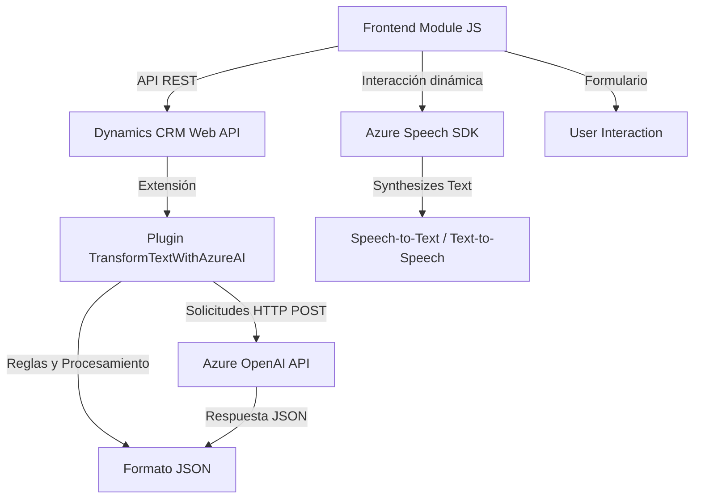

### Breve resumen técnico

El repositorio describe una solución integrada en un entorno Dynamics CRM que utiliza **Azure Speech SDK** para servicios de conversión de texto a voz y reconocimiento de voz, así como **Azure OpenAI API** para transformar texto mediante inteligencia artificial. Además, emplea un plugin (.NET) para extender las funcionalidades del sistema CRM y un módulo frontend para integrar funcionalidades dinámicas en formularios.

---

### Descripción de arquitectura

Esta solución se basa en una arquitectura **híbrida**, conformada por un sistema monolítico extendido mediante microfunciones (microservicios). La arquitectura está orientada a eventos y modularidad funcional. Los módulos de frontend están diseñados para comunicar dinámicamente los datos del usuario con APIs externas, mientras que el backend utiliza un plugin que facilita la integración directa entre Dynamics CRM y la API de Azure OpenAI.

- **Frontend**: Modularización de funcionalidades orientadas a eventos en los formularios, con clara separación de las responsabilidades por función.
- **Backend (Plugin)**: Segmentado para cumplir con un único propósito, basado en el patrón de diseño de Plugins de Dynamics CRM, interactuando directamente con APIs externas.

---

### Tecnologías usadas

#### Frontend:
- **JavaScript ES6**: Utilizado para la lógica de interacción dinámica en los formularios.
- **Azure Speech SDK**: Herramienta clave para funciones de síntesis de voz y reconocimiento de voz.
- **Dynamics 365 Web API**: Para acceder y modificar datos directamente desde el entorno CRM.

#### Backend:
- **.NET Framework**: Implementado en el plugin para manejo de eventos en Dynamics CRM.
- **Azure OpenAI API**: Consume modelos GPT-3/4 para la transformación e interpretación del texto.
- **Newtonsoft.Json**: Para la manipulación y procesamiento de datos JSON.
- **HttpClient**: Gestor de solicitudes para consumir API externas.

---

### Diagrama Mermaid válido para GitHub

---

### Conclusión final

El repositorio ejecuta una solución orientada a eventos y extensible que combina procesamiento de datos dinámicos con APIs cognitivas avanzadas. La arquitectura híbrida destaca por su integración fluida entre módulos frontend, backend y servicios externos como el Azure Speech SDK y Azure OpenAI. Las tecnologías y patrones aplicados garantizan un flujo eficiente de datos e interacción dinámica en aplicaciones CRM, cubriendo desde reconocimiento y análisis de voz hasta transformación de texto.