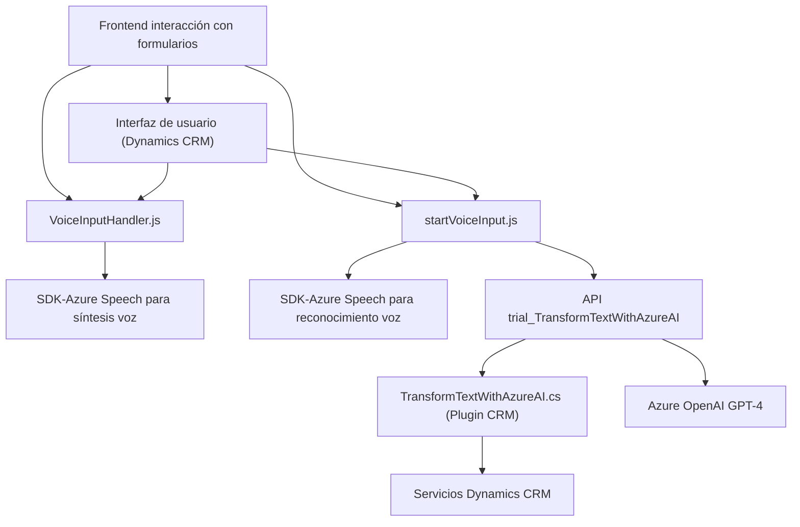

### Breve resumen técnico:
El repositorio describe una solución que implementa funcionalidad de interacción de voz con formularios en una aplicación web integrada con Dynamics CRM. La funcionalidad principal incluye dos áreas: lectura de formularios y síntesis de voz (VoiceInputHandler.js), y transcripción de voz a texto y procesamiento AI (startVoiceInput.js y TransformTextWithAzureAI.cs). La solución integra servicios externos como Azure Speech SDK y Azure OpenAI GPT-4 para ofrecer capacidades avanzadas de transcripción y transformación de texto.

---

### Descripción de arquitectura:
La arquitectura es híbrida con características de una arquitectura de microservicios y arquitectura de capa:
1. Integración horizontal a través de **microservicios**: El uso del plugin en C# para Microsoft Dynamics CRM permite el procesamiento autónomo del texto transformado.
2. **Arquitectura n-capas**: Está organizada con componentes claramente segmentados:
   - **Presentación**: Frontend para interacción con el usuario a través de los formularios (JavaScript frontend responsable de obtener datos y llamar al SDK).
   - **Lógica de negocio**: Funciones del frontend manejan reglas de negocio de interacción con Dynamics CRM y APIs.
   - **Servicios externos**: Uso de SDKs de Microsoft y Azure OpenAI para la síntesis y transcripción.

---

### Tecnologías usadas:
1. **Frontend**: JavaScript.
   - Azure Speech SDK para generación de texto-voz.
   - Integración con Dynamics CRM y llamadas al Web API.
   - Aplicación dinámica de valores en campos CRM mediante las funciones internas como `applyValueToField` y `applyValueToField_IA`.

2. **Backend**: C# (Dynamics CRM Plugin).
   - Implementación de `IPlugin`.
   - Comunicación con Azure OpenAI API usando SDK: procesamiento del texto de entrada mediante GPT-4.

3. **Servicios externos**:
   - **Azure Speech SDK**: Para realizar síntesis de voz y transcripción en tiempo real.
   - **Azure OpenAI GPT-4 API**: Transformación avanzada de texto con reglas predefinidas.
   - **Microsoft Dynamics 365 APIs**: Para la interacción directa con datos en formularios CRM.

4. **Librerías adicionales**:
   - `Newtonsoft.Json` para operaciones con JSON en C#.
   - `System.Net.Http` para la comunicación con APIs.
   - Posible uso del paquete NPM de Microsoft para integración de `SpeechSDK`.

---

### Diagrama Mermaid:

---

### Conclusión final:
La solución implementa una integración estratégica entre un frontend basado en JavaScript y un backend habilitado mediante plugins de Dynamics CRM y Azure OpenAI. Los componentes colaboran para lograr un sistema intuitivo y funcional de captura y síntesis de voz, diseñado para trabajar con formularios en la plataforma Dynamics CRM. La arquitectura está orientada a servicios y utiliza múltiples patrones como integración de SDKs, procesamiento en capas, y puertas de enlace API. Se recomienda mejorar el manejo de claves API, estandarizar la validación y manejo de errores, y asegurar que las dependencias externas sean configuradas de manera segura para un entorno de producción.