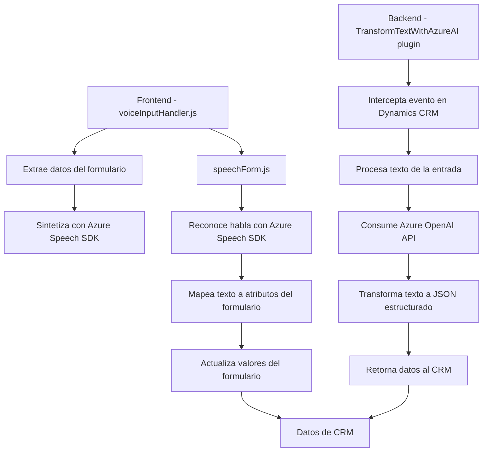

### Breve resumen técnico
El repositorio combina funcionalidades frontend en JavaScript y un plugin backend en C# para la plataforma Microsoft Dynamics CRM, con dependencias de terceros como **Azure Speech SDK** y **Azure OpenAI API**. La solución facilita la interacción usuario-aplicación mediante reconocimiento de voz, síntesis de texto a voz, transformaciones dinámicas de datos y mapeo en formularios.

---

### Descripción de arquitectura
La solución está diseñada con varias capas funcionales:
1. **Frontend (JavaScript):**
   - Procesa datos de formularios y utiliza el SDK de Azure Speech para funciones de reconocimiento de voz y síntesis de texto a voz.
   - Usa patrones modulares para gestionar funcionalidad como mapeo y aplicación de valores en el formulario, garantizando extensibilidad.

2. **Backend (C# Plugin):**
   - Utiliza el patrón **Plugin** de Dynamics CRM para interceptar eventos.
   - Actúa como proxy entre Dynamics y Azure OpenAI API, transformando texto según reglas específicas y devolviendo JSON estructurado de acuerdo con las normas aplicadas.

La arquitectura global puede ser categorizada como **n-capas**:
- **Presentación:** Frontend JS interactuando con el usuario mediante la interfaz del CRM.
- **Negocio:** Plugin C# que realiza lógica específica de transformación y mapeo.
- **Datos:** CRM como fuente de información y almacenamiento de los resultados procesados; también utiliza APIs externas para enriquecer los datos.

---

### Tecnologías usadas
1. **Frontend:**
   - **JavaScript**: Para procesar voz y valores del formulario.
   - **Azure Speech SDK**: Reconocimiento de voz y síntesis de texto a voz.
   - **Dynamics CRM APIs**: Gestión del modelo de objetos del formulario.
   - **HTTP/REST APIs**: Procesos de interacción externa como el SDK de Azure Speech.

2. **Backend:**
   - **C# Plugin Framework**: Implementación de lógica personalizada en Dynamics CRM.
   - **Azure OpenAI API**: Transformación de texto en formato JSON utilizando IA.
   - **Newtonsoft.Json/System.Text.Json**: Serialización/deserialización de objetos JSON.

---

### Diagrama Mermaid válido para GitHub

---

### Conclusión final
Esta solución representa una integración efectiva de un sistema frontend basado en JavaScript con un backend en C# plug-ins para Dynamics CRM, aprovechando tecnologías de Azure para reconocimiento y síntesis de voz, así como para procesamiento de texto usando AI. La arquitectura modular facilita la extensibilidad y mantenimiento, mientras que los patrones orientados a servicios garantizan flexibilidad a la hora de integrar APIs externas.

Sin embargo, el código puede mejorarse implementando patrones de seguridad en la gestión de credenciales externas (como claves de Azure Speech SDK y OpenAI API) y reutilización de componentes en ambos niveles, reduciendo acoplamientos. Heméticamente, las dependencias de Azure y Dynamics sitúan la solución dentro del ecosistema Microsoft, recomendando la adopción de prácticas como **contenedores o servicios desacoplados** para futuras mejoras.