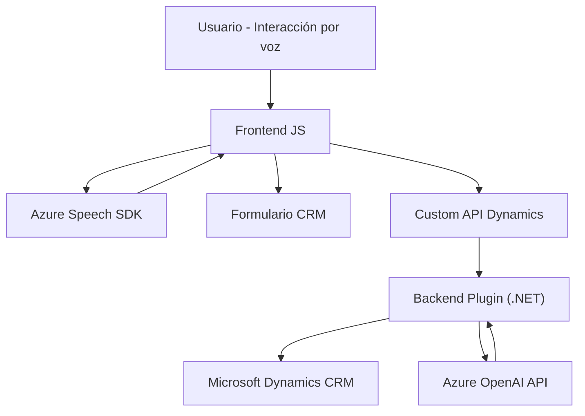

### Breve resumen técnico

El repositorio parece ser parte de una solución integrada que incluye funcionalidades como entrada por voz, procesamiento avanzado basado en IA y transformación de texto para formularios en el contexto de Microsoft Dynamics CRM. Utiliza Azure Speech SDK para convertir datos de formularios en voz, Azure OpenAI para transformar texto en JSON estructurado y APIs de Dynamics 365 para interactuar directamente con datos de los formularios. Además, emplea una combinación de JavaScript y .NET codebases para abordar diferentes aspectos técnicos.

---

### Descripción de arquitectura

La solución utiliza una arquitectura **mixta basada en n capas e integración de microservicios**:
1. **Frontend**:
   - Implementación en JavaScript basada en SDK externo (Azure Speech) y manipulación de formularios desde Dynamics.
   - Comunicación directa con servicios externos mediante callback y promesas.

2. **Backend**:
   - Plugin desarrollado en .NET como parte del Microsoft Dynamics CRM SDK.
   - Proceso asincrónico hacia Microsoft Azure OpenAI para el procesamiento de texto.

3. **Integración de servicios externos**:
   - Dependencias con Azure Speech SDK y Azure OpenAI API.
   - Acceso directo a la Web API de Dynamics para manipulación de datos del modelo CRM.

Por tanto, la solución parece basada en una arquitectura **híbrida**, donde el frontend sigue patrones de modularidad y adaptador, mientras que el backend está diseñado conforme al modelo extensible de plugins de Microsoft CRM.

---

### Tecnologías usadas
1. **Frontend**:
   - **JavaScript** para manipulación del DOM y lógica de voz.
   - **Azure Speech SDK**: Para conversión de texto a voz y entrada desde voz reconocida.
   - **Microsoft Dynamics Web API**: Para manipular datos y llamar APIs personalizadas.

2. **Backend**:
   - **Microsoft Dynamics CRM SDK**: Para características extensibles del contexto CRM.
   - **.NET Framework (C#)**.
   - **Azure OpenAI API**: Para procesamiento avanzado de texto en el plugin.

3. **Patrones usados**:
   - Cargador dinámico de SDK en el frontend.
   - Delegación mediante callbacks para cargar dependencias en tiempo de ejecución.
   - Modularidad con funciones independientes y específicas.
   - MVC en la gestión de formularios y datos en el modelo.
   - Command Pattern en el backend basado en eventos del CRM (mediante `IPlugin`).

---

### Diagrama Mermaid válido para GitHub

---

### Conclusión final

Este repositorio representa una solución integrada que mezcla frontend y backend junto con servicios externos para crear una experiencia avanzada de interacción por voz y procesamiento de formularios. La arquitectura combina elementos de un sistema basado en n capas, con integración de microservicios para incorporar dependencias externas, como Azure Speech SDK y Azure OpenAI. El uso de Dynamics Web API conecta el frontend con los datos del CRM, mientras que el plugin permite la ejecución de reglas más complejas mediante el Command Pattern.