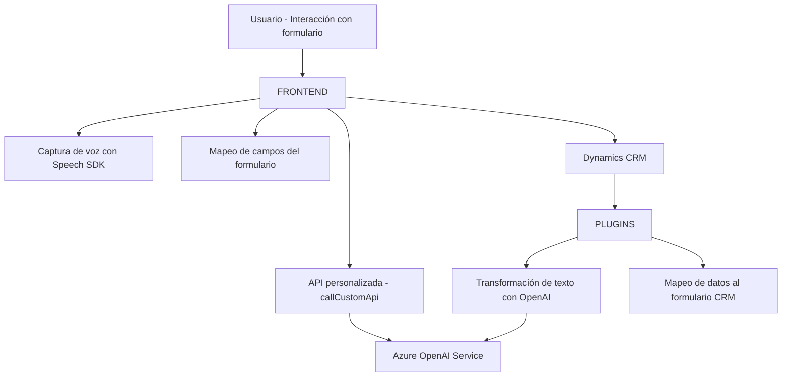

### Resumen técnico:
El repositorio muestra una solución orientada a la interacción basada en voz con formularios de Dynamics 365, la conversión y ejecución de operaciones mediante Microsoft Azure Speech SDK y OpenAI Service. Se divide en módulos frontend, que gestionan la captura de voz y mapeo a campos del formulario, y backend con plugins que integran Azure OpenAI para enriquecer el contenido de datos.

---

### Descripción de arquitectura:
1. **Tipo de solución:**  
   Es una solución híbrida situada entre una aplicación web frontend y un plugin backend para Dynamics CRM. El frontend integra Azure Speech SDK y APIs privadas (Azure AI), mientras que el backend, desarrollado en C#, expone una funcionalidad para el procesamiento avanzado de texto y datos utilizando OpenAI.

2. **Arquitectura:**  
   - **N-capas:** La solución se organiza en capas:
     - **Capa de usuario (frontend):** que gestiona la interacción y captura de voz.
     - **Capa de lógica de negocios (backend):** que realiza transformación de texto enriquecido y relaciones de datos en el CRM.
     - **Capa de datos:** interacción directa con Dynamics 365.

---

### Tecnologías usadas:
1. **Frontend:**  
   - **JavaScript:** Para modularizar la funcionalidad de entrada de voz, procesamiento de datos del formulario y llamadas API.
   - **Azure Speech SDK:** Como servicio de síntesis y reconocimiento de voz.
   - **Dynamics CRM Web API:** Interacciones con formularios de Dynamics.

2. **Backend:**  
   - **C# (.NET Framework):** Lenguaje para desarrollar plugins de Dynamics 365.
   - **Azure OpenAI Service (GPT):** Asiste con la generación de datos estructurados desde el texto.
   - **Newtonsoft.Json.Linq:** Manipulación eficiente de JSON en el plugin.

3. **Cloud services:**  
   - Microsoft Azure, ofreciendo servicios de IA (OpenAI) y voz (Speech SDK).

---

### Dependencias o componentes externos:
1. Servicios cloud externos:
   - **Azure Speech SDK:** Transcripción de entrada de voz y síntesis de texto a voz.
   - **Azure OpenAI Service:** Procesamiento avanzado de texto con inteligencia artificial (GPT).
   - **Dynamics 365 Web APIs:** Integración con formularios y entidades del CRM.
2. Libs externas:
   - **Newtonsoft.Json.Linq** para JSON en plugins.
3. Internos:
   - `ExecutionContext` y `formContext` de Dynamics CRM para mapear campos y generar datos.

---

### Diagrama Mermaid válido para GitHub:

---

### Conclusión final:
Esta solución representa una arquitectura **n-capas** que utiliza herramientas modernas para mejorar la interacción del usuario en aplicaciones empresariales basadas en Dynamics 365. La integración con servicios de Azure potencia las capacidades de interacción natural mediante voz y el procesamiento de texto enriquecido con IA. Consideraciones adicionales, como la seguridad del manejo del API Key de OpenAI directamente en el código y posibles límites de Azure Speech SDK, deben ser revisadas para asegurar la producción. El diseño modular favorece la escalabilidad y mantenibilidad.