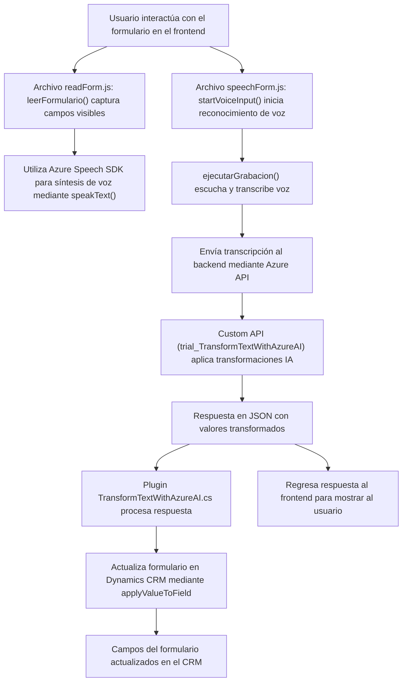

### Breve resumen técnico
El repositorio parece ser parte de un proyecto que utiliza **Azure Speech SDK** y APIs personalizadas para integrar funcionalidades de conversión de texto a voz, reconocimiento de voz y procesamiento de texto con IA en un sistema CRM como **Microsoft Dynamics CRM**. El proyecto combina un cliente frontend basado en JavaScript con plugins en C# para extender las capacidades del CRM mediante servicios cognitivos de Azure.

### Descripción de arquitectura
La arquitectura tiene un enfoque híbrido, combinando funcionalidades locales en el frontend con servicios externos basados en Azure y C# plugins para Dynamics CRM. Las siguientes observaciones son relevantes:
- **Frontend modular**: Organizado en funciones según su responsabilidad (lectura de formularios, reconocimiento de voz, síntesis de voz, etc.).
- **Backend orientado a servicios externos**: Uso de patrones de integración con APIs externas (Azure Speech y OpenAI) desde un plugin en C#.
- **CRM Plugin architecture**: Extensión del CRM mediante la interfaz `IPlugin`.
- **Event-driven architecture** en el frontend y los plugins, que dependen de eventos de ejecución y callbacks asíncronos.

### Tecnologías usadas
1. **Frontend**:
   - Lenguaje: JavaScript.
   - Framework: Podría estar integrado con un framework (como Angular o React), aunque en los archivos proporcionados no es evidente.
   - SDK: **Azure Speech SDK** para conversión de texto a voz y reconocimiento de voz.
   - CRM API: **Xrm.WebApi.online**, para la gestión de datos en Microsoft Dynamics CRM.

2. **Backend**:
   - Lenguaje: C#.
   - CRM SDK: **Microsoft Dynamics CRM SDK** (interfaz `IPlugin`).
   - APIs externas: Integración con **Azure OpenAI GPT-4** para transformar texto y devolver valores estructurados.
   - Bibliotecas: `System.Net.Http`, `Newtonsoft.Json`, entre otras para manejo de API REST y JSON.

### Arquitectura
La solución integra diversas tecnologías en una **n-capas distribuida**, donde las tareas se dividen en las siguientes partes:
1. **Frontend**: Procesa interacciones de usuarios con formularios, realiza transformaciones con Azure Speech SDK y consume APIs remotas (procesamiento de texto).
2. **API personalizada**: Proporciona servicios de inteligencia artificial (GPT-4) para transformar datos.
3. **Backend Plugin**: Código C# orientado al cielo de extensibilidad de Dynamics CRM mediante `IPlugin` y el modelo de eventos del sistema.

Adicionalmente, hay elementos de **event-driven architecture** en el manejo de eventos para cargar SDKs y procesar datos de usuario.

### Dependencias o componentes externos
1. **Azure Speech SDK**: Manejo de voz (sintetizar texto en audio y reconocimiento de voz).
2. **Azure AI (OpenAI GPT-4)**: Procesamiento avanzado de texto, como transformaciones mediante APIs creadas en el backend.
3. **Microsoft Dynamics CRM SDK**: Extensión del CRM con plugins para manejar datos importantes y ejecutar operaciones customizadas.
4. **Custom API**: Posible API creada específicamente para consumir un servicio de transformación de texto con Azure OpenAI.

---

### Diagrama Mermaid

---

### Conclusión final
La solución es una integración avanzada de tecnologías como **Azure Speech SDK** y **Azure OpenAI** en un entorno **Microsoft Dynamics CRM**. La implementación brinda capacidades para sintetizar voz, reconocer transcripciones y utilizar inteligencia artificial para transformar texto. La separación funcional en frontend y backend junto con el uso de plugins representa un diseño distribuido, modular y extensible.