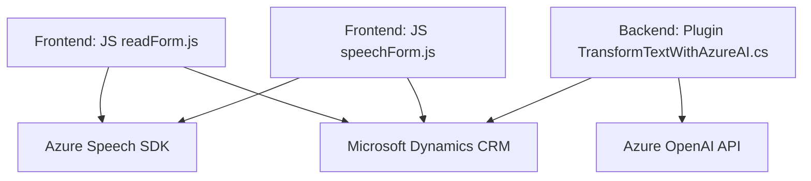

### Breve resumen técnico

En este análisis, se presenta un sistema híbrido compuesto por módulos frontend en JavaScript y plugins backend desarrollados en C#. Los archivos analizados, en conjunto, forman parte de una solución que integra un sistema de formularios que puede procesar datos tanto en texto como en voz. Este sistema utiliza APIs externas, como el Azure Speech SDK y Azure OpenAI, para implementar reconocimiento de voz, síntesis de voz y transformación de texto en JSON. Además, el código está orientado a operar en un entorno CRM (Microsoft Dynamics).

---

### Descripción de arquitectura
Esta solución utiliza una **arquitectura orientada a servicios integrados**, donde:

1. **Frontend:** Se encarga de la interacción con el usuario para capturar datos desde formularios y activar interfaces de entrada y salida de voz. Adopta un modelo modular con funciones específicas (entrada de voz, extracción de campos formales, síntesis de voz, etc.).
2. **Backend/plugin:** Asocia un plugin ejecutado en el contexto de Microsoft Dynamics CRM que aplica lógica de transformación avanzada utilizando el servicio de Azure OpenAI. Este plugin sigue un modelo **event-driven**, activo únicamente en situaciones específicas del CRM (como la modificación de registros).

La arquitectura parece ser de **n capas**, con diferenciación entre:
- **Capa de presentación:** Gestionada por los archivos en `FRONTEND/JS` para interactuar directamente con el usuario.
- **Capa de negocio:** Implementada en el plugin `TransformTextWithAzureAI.cs` con conexión directa al CRM y enlace a servicios externos.
- **Capa de servicios externos:** Integraciones con Azure OpenAI y Azure Speech SDK.

---

### Tecnologías, frameworks y patrones usados
**Frontend:**
- **Tecnologías & Frameworks**:
  - **JavaScript** (compatibilidad con navegadores).
  - Uso del **Azure Speech SDK** para reconocimiento y síntesis de voz.
  - Entorno CRM (Microsoft Dynamics): proporciona objetos como `Xrm.WebApi`.
  - Procedimientos asíncronos basados en `promises` para integraciones externas.
- **Patrones:**
  - Modularidad: Uso de funciones con responsabilidad única (SOLID).
  - Delegate/Callback Pattern: Uso de callbacks para acciones asincrónicas como la carga del SDK.

**Backend (Plugin Dynamics):**
- **Tecnologías & Frameworks**:
  - **Microsoft Dynamics CRM SDK** para la conexión con el entorno CRM.
  - **Azure OpenAI API** para el procesamiento basado en inteligencia artificial.
  - Framework .NET y herramientas como `HttpClient` y JSON (System.Text.Json y Newtonsoft.Json) para el manejo de peticiones y datos.
- **Patrones:**
  - Plug-in Design Pattern: Código que es ejecutado en eventos específicos dentro de plataformas como Dynamics CRM.
  - **Orientación a servicios:** Uso de APIs externas dentro de lógica de CRM.
  - **Encapsulación de lógica:** Métodos aislados para procesamiento independiente.

---

### Dependencias y componentes externos
1. **Azure Speech SDK**: Para habilitar reconocimiento y síntesis de voz. Requiere claves de suscripción y región específica.
2. **Azure OpenAI API**: Para el procesamiento avanzado de texto. Requiere endpoint, deployment, versión de API y claves de autenticación.
3. **Microsoft Dynamics CRM SDK**: Para integración en entorno CRM usando objetos como `IServiceProvider`, `InputParameters`, y `OutputParameters`.
4. **Bibliotecas estándar**:
   - `System.Text.Json` y `Newtonsoft.Json` para el manejo y serialización de JSON.
   - `System.Net.Http` para realizar peticiones HTTP.
5. **Entorno CRM (Xrm.WebApi)**: Utilizado en los módulos frontend para gestión y modificación de datos en el sistema de Dynamics.

---

### Diagrama Mermaid válido para GitHub

---

### Conclusión final
Este repositorio implementa una solución híbrida con enfoque en la integración de tecnologías de reconocimiento y síntesis de voz (Azure Speech SDK) y procesamiento avanzado de texto asistido por IA (Azure OpenAI). Su estructura modular y basada en eventos permite una integración fluida con Microsoft Dynamics CRM.

La arquitectura es principalmente de **n capas**, con diferenciación entre la capa de presentación (frontend), la capa de negocio (plugin de Dynamics), y los servicios externos (Azure Speech y OpenAI). La implementación usa patrones claros de modularidad, delegados/asíncronos, y encapsulación lógica.

Este diseño permite una fácil escalabilidad, ya que la intermediación entre frontend, backend y servicios externos está bien definida y desacoplada. Es ideal para entornos empresariales que requieren interacción personalizada mediante voz y procesamientos avanzados de texto.