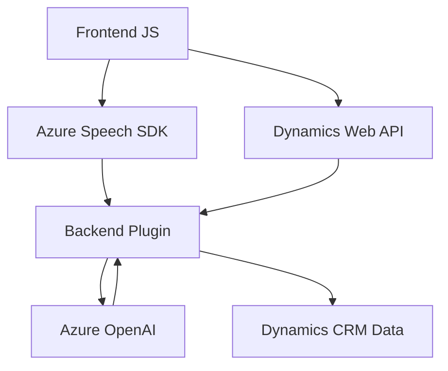

### Breve Resumen Técnico

El proyecto implementa una solución destinada a mejorar la interacción de usuarios con formularios de Dynamics CRM mediante entrada de voz y procesamiento de texto asistido por IA. Combina un frontend en JavaScript con Dynamics 365 y el servicio de Azure Speech SDK, además de un plugin de backend que utiliza Azure OpenAI para transformar texto según reglas específicas.

---

### Descripción de Arquitectura

#### Tipo de Solución
Este repositorio representa una **integración para Dynamics CRM** orientada a la interacción mediante voz y procesamiento de texto con IA, conectando componentes de frontend, APIs externas y un plugin en el backend.

#### Tipo de Arquitectura 
La solución parece diseñada bajo una arquitectura de **n capas**, con separación clara de responsabilidades:
1. **Frontend**: Scripts JavaScript que actúan como cliente y coordinador entre el formulario y SDK/IA.
2. **Middleware**: Interacción con Azure services (Speech SDK y OpenAI).
3. **Backend (Dynamics Plugin)**: Extiende la funcionalidad de Dynamics CRM mediante un plugin que conecta con Azure OpenAI para realizar operaciones predefinidas basadas en reglas.

El enfoque general no es un microservicio, ya que utiliza Dynamics CRM como un único sistema central y las operaciones se componen de módulos que interactúan directamente con dicho sistema.

---

### Tecnologías Usadas
1. **Frontend:**
   - **JavaScript**: Lógica del cliente para conectar con el SDK y procesar formularios.
   - **Azure Speech SDK**: Síntesis y reconocimiento de voz.
   - **Dynamics Web API**: Para leer y actualizar registros del CRM.

2. **Backend:**
   - **C# .NET**: Desarrollo del plugin de Dynamics CRM.
   - **Microsoft Dynamics SDK (`Microsoft.Xrm.Sdk`)**: Extensión del formulario y procesamiento de eventos.
   - **Azure OpenAI API**: Implementa la transformación avanzada de texto con IA.
   - **HTTP Client & JSON manipulación (`System.Net.Http`, `Newtonsoft.Json.Linq`)**: Gestión de solicitudes al endpoint externo y manejo de respuestas.

---

### Dependencias o Componentes Externos
1. **Azure Speech SDK**: Para reconocimiento y síntesis de voz.
2. **Dynamics Web API**: Para interoperar con datos del formulario.
3. **Azure OpenAI (Backend)**: Text-transforming service, ideal para procesar texto mediante Machine Learning.
4. **Plugin Dynamics CRM**: Extensión del sistema para enriquecer datos con AI.
5. **Custom APIs** (trial_TransformTextWithAzureAI): Procesamiento basado en IA.

---

### Diagrama Mermaid (válido con GitHub Markdown)

---

### Conclusión Final

La solución integra tecnologías avanzadas para habilitar una experiencia de usuario mejorada en Dynamics CRM mediante interacción por voz y procesamiento IA. La arquitectura basada en capas (frontend, middleware y backend) asegura una separación de responsabilidades bien definida. 

#### **Fortalezas:**
- Modularidad y escalabilidad por el uso de SDKs y APIs externas.
- Uso de IA (OpenAI) para enriquecer la funcionalidad del CRM.
- Aprovechamiento de sistemas preexistentes como Dynamics CRM.

#### **Áreas de Mejora:**
- Gestión de claves y configuración de Azure API podría ser revisada para mejorar la seguridad.
- Documentación extensiva de los puntos de integración es crucial para facilitar el mantenimiento a largo plazo.
