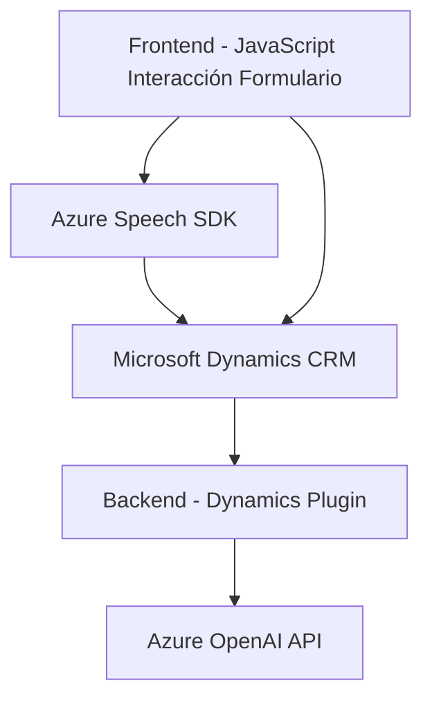

**Breve resumen técnico:**

El repositorio implementa una solución híbrida que integra interacción dinámica con formularios, procesamiento de voz a texto y procesamiento de texto a voz utilizando tecnologías de Microsoft como Dynamics 365, Azure Speech SDK y Azure OpenAI. Consiste en tres componentes principales: un frontend (JavaScript), un plugin backend (.NET para Dynamics CRM), y dependencias externas de procesamiento avanzado de datos.

---

**Descripción de arquitectura:**

1. **Tipo de solución:**  
   Es una solución basada en la interacción con formularios dentro del ecosistema de Microsoft Dynamics CRM, integrando funcionalidades de voz y texto. Funciona como una extensión de Dynamics y puede clasificarse como una infraestructura híbrida que incluye un frontend interactivo y plugins para el backend.

2. **Arquitectura:**  
   La arquitectura combina elementos de **n capas** y **event-driven architecture**, ya que separa claramente las funcionalidades frontend (procesamiento de formularios y voz) y backend (procesamiento de datos dinámicos mediante Azure AI). Aunque técnicamente no es totalmente microservicios, el uso de APIs externas (Azure OpenAI) señala una **integración basada en servicios externos**, con separación de módulos.

---

**Tecnologías usadas:**

- **Frontend:**
  - Azure Speech SDK.
  - JavaScript ES6.
  - Promesas y funciones asincrónicas.

- **Backend:**
  - .NET Framework.
  - Dynamics CRM SDK.
  - Azure OpenAI GPT-4 para procesamiento de reglas de texto.

- **Patrones aplicados:**
  - **Modularidad:** Cada componente (función, clase) tiene responsabilidades específicas.
  - **Integraciones basadas en SDK:** Uso del SDK de Azure Speech para reconocimiento y síntesis de voz.
  - **Plugin-Based Architecture:** El backend define un plugin conectado al ciclo de eventos de Dynamics CRM.
  - **Event-Driven Architecture:** Integración basada en eventos disparados en el contexto CRM.

---

**Diagrama Mermaid (GitHub Markdown compatible):**

**Conclusión final:**

La solución implementada en este repositorio demuestra una integración avanzada de tecnologías Microsoft para mejorar la experiencia de usuario en dinámicas de formularios dentro de Dynamics CRM. Utiliza el poder del Azure Speech SDK para interacción basada en voz y el servicio Azure OpenAI GPT-4 para procesos avanzados de inteligencia artificial, cumpliendo un enfoque de separación de responsabilidades. La arquitectura general es eficiente para escenarios donde las integraciones dinámicas y accesibilidad por voz son esenciales.