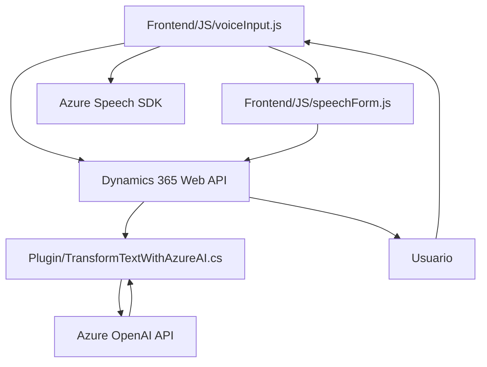

### Resumen técnico

El repositorio analizado implementa una solución que integra distintas componentes para reconocimiento y síntesis de voz, procesamiento de texto con inteligencia artificial y manipulación dinámica de formularios en **Microsoft Dynamics 365**, utilizando los servicios de Azure como **Speech SDK** y **Azure OpenAI**. 

Principalmente, parece que estamos ante una solución híbrida que combina:
1. **Frontend interactivo:** Basado en JavaScript con soporte para interacción dinámica de formularios.
2. **Backend en Dynamics CRM:** Extendido mediante plugins (C#) y acceso a APIs externas.

---

### Descripción de arquitectura

La arquitectura general puede clasificarse como **n-capas**, donde:
- El **Frontend** actúa como capa de presentación: Maneja la interacción con el usuario utilizando Azure Speech SDK para síntesis y reconocimiento de voz, además de interacción con fomularios dinámicos.
- El **Backend** (plugin de Dynamics CRM en C#) opera como capa lógica: Realiza transformaciones avanzadas de texto mediante Azure OpenAI y actualiza reglas en el sistema CRM.
- Los **Servicios externos** (Azure APIs) conforman la capa de integración: Se encargan de contacto con APIs de IA y sintetización/interpretación de voz.

---

### Tecnologías usadas

#### **Frontend**
1. **Lenguaje**: JavaScript.
2. **Framework**: Dynamics 365 SDK para JavaScript (`executionContext`, `Xrm.WebApi.online.execute`).
3. **Servicios externos**:
   - **Azure Speech SDK**: Utilizado para síntesis de voz y reconocimiento de audio.
   - **Dynamics 365 Web API**: Interacción RESTful con el formulario.
4. **Patrones arquitecturales**: 
   - Modularidad por funciones específicas.
   - Encadenamiento funcional (flujo lógico en operaciones).
   - Dependencia dinámica: El SDK de Azure Speech se carga _on-demand_ para evitar consumo innecesario.

#### **Backend (Plugins en C#)**
1. **Lenguaje**: C#.
2. **Frameworks**: Dynamics CRM SDK (`IPlugin`, `IOrganizationService`).
3. **Servicios externos**:
   - **Azure OpenAI API**: Usado para transformar texto dinámico basándose en normas predefinidas.
4. **Bibliotecas**:
   - Newtonsoft.Json y System.Text.Json: Procesamiento JSON.
   - HttpClient: Comunicación HTTP asincrónica.
5. **Patrones arquitecturales**:
   - **Pluggable Architecture**: Extensión del CRM mediante la interfaz `IPlugin`.
   - **Interfaz-Adaptador**: Uso de abstracciones (`IServiceProvider`) para desacoplar la lógica.
   - **Single Responsibility Principle**: Métodos como `Execute` y `GetOpenAIResponse` tienen un rol específicamente definido.

---

### Dependencias o componentes externos

1. **Azure Speech SDK**: Usado tanto para síntesis de texto como reconocimiento de voz.
2. **Dynamics CRM Web API**: Permite integrar datos y ejecutar operaciones en formularios dinámicos.
3. **Azure OpenAI API**: Gestión y procesamiento avanzado de texto.
4. **JavaScript SDK para Dynamics**: Facilita acceso al DOM y contexto del sistema CRM.
5. **Bibliotecas JSON** (Newtonsoft.Json y System.Text.Json): Manejo fácil y estructurado de contenido JSON en C#.

---

### Diagrama Mermaid válido para GitHub

---

### Conclusión final

Este repositorio implementa una solución **interactiva y dinámica** basada en servicios de Azure y Microsoft Dynamics CRM, diseñada con una arquitectura **n-capas** que mezcla la manipulación de formularios, reconocimiento/síntesis de voz, y procesamiento de texto avanzado basado en IA. El diseño modular y el uso de patrones arquitecturales estándar aseguran la fácil escalabilidad y mantenimiento. Sin embargo, hay consideraciones sobre **seguridad en claves API**, que deberían gestionarse mediante herramientas o configuraciones más robustas en entornos de producción.