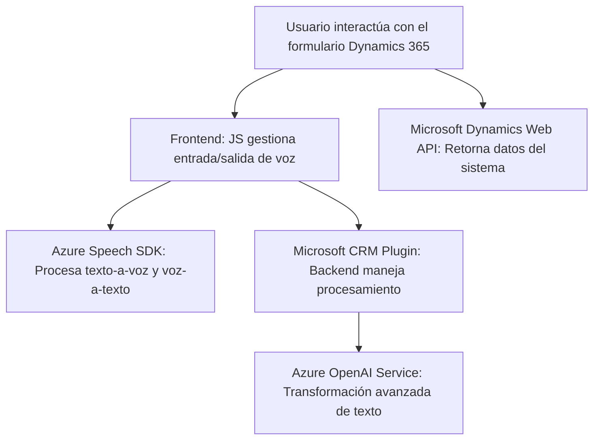

### Breve Resumen Técnico

El repositorio contiene archivos para un sistema que integra funcionalidades de entrada y salida de voz basadas en Azure Speech SDK y transformación de texto usando Azure OpenAI. Se observa que el sistema interactúa con formularios en Microsoft Dynamics 365 y con servicios de Azure Cognitive Services.

---

### Descripción de la Arquitectura

La solución tiene una arquitectura **n-capas** donde:
1. El frontend (JavaScript) actúa como capa de interacción usuario-visual-directa para formularios.
2. Los plugins (C#) se integran en la lógica de backend de Microsoft Dynamics 365, extendiendo su funcionalidad mediante servicios como Azure OpenAI.
3. Servicios externos (Azure Cognitive Services y Dynamics Web API) complementan las funcionalidades principales.

El sistema prioriza la separación de responsabilidades:
- **Frontend:** Lectura y escritura de datos del formulario con entrada/salida de voz.
- **Backend:** Transformación de datos y reglas de negocio a través de un plugin conectado a Azure OpenAI.

---

### Tecnologías Usadas

1. **Frontend:**
    - **JavaScript:** Lógica para manipulación de formularios e integración con Azure Speech SDK.
    - **Azure Speech SDK:** Implementación de entrada de voz y síntesis de texto.
    - **Microsoft Dynamics API:** Usada para la interacción directa con los formularios y datos del sistema.

2. **Backend Plugins (C#):**
    - **Microsoft CRM SDK:** Extensión funcional del sistema.
    - **Azure OpenAI Service:** Transformación avanzada de texto usando modelos GPT-4.

3. **Dependencias Externas:**
    - `Newtonsoft.Json` y `System.Text.Json` para manejo de objetos JSON.
    - HTTP cliente (`System.Net.Http`) para integración con servicios REST.
    - Azure para IA y Speech.

---

### Diagrama Mermaid

---

### Conclusión Final

El sistema integra **Azure Speech SDK** para la interacción por voz en los formularios de Dynamics 365, y complementa la funcionalidad con **Azure OpenAI** para procesamiento semántico avanzado. Su arquitectura mezcla conceptos de **n-capas** y servicios externos (Azure Cognitive Services y Dynamics Web API) para permitir la interacción dinámica y fluida entre el usuario y el sistema.

La solución es altamente extensible y modular, lo que permite manejar dependencias externas fácilmente y mantener una clara separación de responsabilidades. Es ideal para escenarios donde se necesite interacción avanzada entre voz y datos con soporte de inteligencia artificial en aplicaciones empresariales.