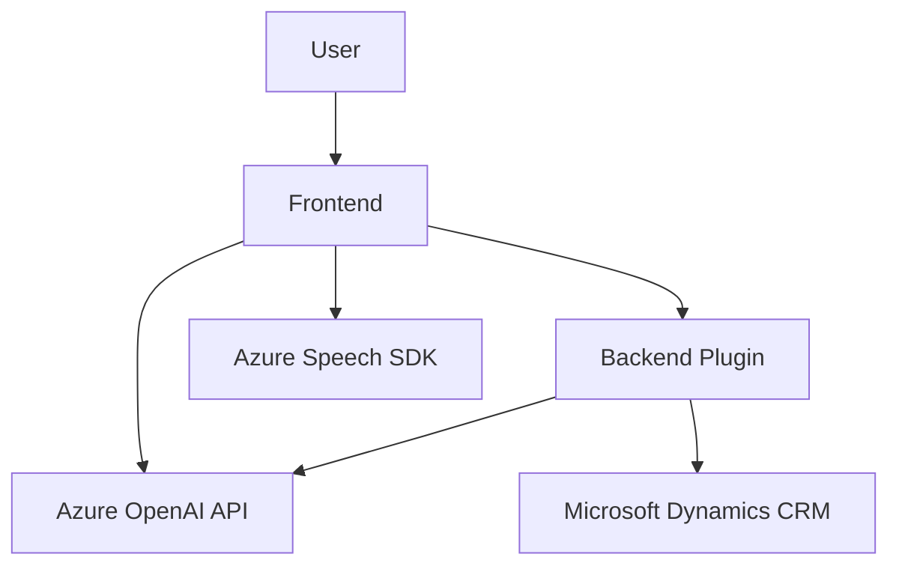

### Breve resumen técnico:

El repositorio representa una solución modular con componentes distribuidos entre frontend y backend, destinada a enriquecer las capacidades de interacción entre usuarios y formularios a través de reconocimiento de voz y procesos basados en AI. Los archivos presentados implementan funciones de sintetización de voz, captura de datos de formularios y procesamiento de comandos de voz con APIs externas (Azure Speech SDK y Azure OpenAI).

---

### Descripción de arquitectura:

La solución utiliza una **arquitectura orientada a servicios (SOA)** en combinación con patrones de diseño modular en el frontend y plugins con integración externa en el backend. La arquitectura no es estrictamente de microservicios, pero sí presenta una división clara de responsabilidades entre el frontend y el backend. 

- **Frontend:** 
  Implementa funciones distribuidas y modulares para interacción con formularios por voz. Cada archivo define funcionalidades específicas con un alto grado de acoplamiento con Azure Speech SDK.
  
- **Backend:** 
  Aplica plugins orientados a servicios que extienden las capacidades de Microsoft Dynamics CRM para integrar funciones de OpenAI en operaciones específicas.

---

### Tecnologías usadas:

1. **Frontend:**
   - Idioma: JavaScript (frontend).
   - SDK: Azure Speech SDK (gestión de síntesis y reconocimiento de voz).

2. **Backend:**
   - Idioma: C#.
   - Framework: Microsoft Dynamics CRM SDK.
   - API Externa: Azure OpenAI y Microsoft Speech SDK.

3. **Infraestructura:**
   - Servicios en la nube: Microsoft Azure.
   - Comunicación con APIs: HTTP client para consumir servicios externos.

---

### Diagrama Mermaid válido para GitHub:

---

### Conclusión final:

La solución presentada integra múltiples tecnologías y servicios centralizados en capacidades de voz e inteligencia artificial. En el frontend, se observa una estructura modular que aprovecha un SDK externo (Azure Speech SDK) para sintetizar voz y capturar datos, mientras que el backend extiende las funcionalidades de Microsoft Dynamics CRM a través de un plugin que interactúa con Azure OpenAI API.

El fuerte acoplamiento con servicios externos asegura capacidades avanzadas de AI y síntesis de voz, aunque expone dependencias críticas con Microsoft Azure. Para mejorar la seguridad, se recomienda externalizar las claves de API a configuraciones protegidas, como Azure Key Vault, y garantizar resiliencia ante posibles fallos de red mediante técnicas de reintento.