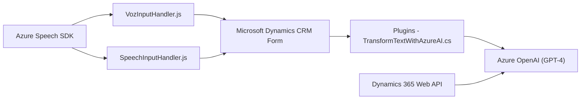

### Breve resumen técnico
El repositorio consta de tres archivos principales que implementan funcionalidades específicas para capturar datos de formularios en **Microsoft Dynamics CRM**, procesarlos y transformarlos mediante servicios externos de Azure. Se integran servicios de reconocimiento/síntesis de voz y procesamiento de texto con AI para operar en tiempo real desde el cliente y el servidor.

---

### Descripción de arquitectura
#### Tipo de solución:
- La solución tiene aspectos de **client-side logic** (archivos JavaScript para formularios de Dynamics CRM) y **server-side extensibility** (plugin que procesa datos en el backend de Dynamics CRM).

#### Tipo de arquitectura:
- **Arquitectura en capas** (n-tier): Con separación lógica entre las capas de presentación (formulario Dynamics CRM), lógica de negocio (procesamiento en servidor y cliente) y servicios externos (Azure Speech Services y Azure OpenAI).
- Algunos archivos como el plugin (`TransformTextWithAzureAI.cs`) utilizan patrones propios de **hexagonal architecture** al permitir integración con APIs externas para transformar datos mediante Azure OpenAI.
- **Event-driven**: Uso de callbacks en la lógica del cliente y eventos del plugin en Dynamics CRM.

#### Modulo principal:
- **Frontend/JS**: Administración de texto y voz en formularios.
- **Plugins**: Procesamiento avanzado con Azure.

---

### Tecnologías usadas
1. **Front-end (JavaScript)**:
   - Azure Speech SDK: Para reconocimiento de voz y síntesis de texto a voz.
   - Dynamics 365 Web API: Para actualización y manipulación de campos del formulario.
   - JavaScript Promises: Para asegurar flujos asíncronos entre SDK y API.
   - Event Listeners y callbacks en SDK.

2. **Back-end (C#)**:
   - Microsoft Dynamics CRM SDK: Para gestionar plugins server-side (IPlugin).
   - Azure OpenAI Service (GPT-4): Para procesamiento avanzado del texto.
   - Librerías JSON (`Newtonsoft.Json`, `System.Text.Json`): Para manejar estructuras JSON.
   - HTTP client (`System.Net.Http`): Para consumir servicios externos.
   - Regular Expressions (`System.Text.RegularExpressions`): Para validaciones específicas.

3. **Servicios externos**:
   - Azure Speech Services (text-to-speech y voz-a-texto).
   - Azure OpenAI API (GPT-4 para transformación estructurada de texto).

---

### Dependencias o componentes externos
#### Externos:
- Azure Speech SDK: Para síntesis de voz y reconocimiento.
- Azure OpenAI API: Procesamiento de texto avanzado.
- Dynamics 365 Web API: Manipulación del estado de formularios y entidades en el CRM.

#### Internos:
- **formContext**: Objeto interno de Dynamics CRM para contexto del formulario.
- Librerías estándar en JavaScript/C# para manejo de datos y llamadas HTTP.

---

### Diagrama Mermaid válido

---

### Conclusión final
La solución presentada es una integración avanzada entre sistemas externos de Microsoft Dynamics CRM, Azure Speech Services y Azure OpenAI para enriquecer la experiencia del usuario en formularios. Utiliza JavaScript para interacción en el cliente y C# para lógica extensible del servidor. La arquitectura está bien definida con una orientación modular y adecuada separación de responsabilidades. Se destaca el uso de tecnologías actuales como servicios de Inteligencia Artificial (Azure), facilitando funcionalidades de síntesis de voz y transformación de texto en un contexto profesional de CRM.