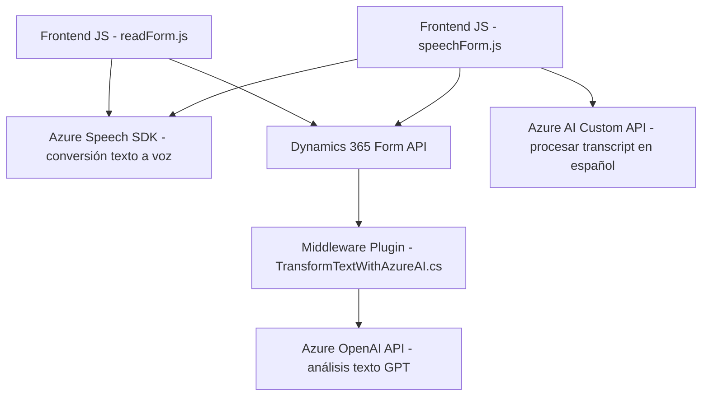

### Breve Resumen Técnico:
El repositorio tiene una funcionalidad orientada a la integración entre formularios de **Dynamics 365** y servicios de **Azure Speech SDK** y **Azure OpenAI API**. Los archivos están organizados por componentes específicos:
- Archivos **frontend/JS** implementan lógica de cliente en JavaScript para interacción con formularios y reconocimiento/síntesis de voz.
- Archivo **TransformTextWithAzureAI.cs** es un plugin que extiende las funcionalidades de Dynamics 365 procesando datos con IA.

Las tecnologías permiten:
1. Reconocimiento y síntesis de voz en el cliente usando SDKs de Azure.
2. Llamadas a APIs externas para inteligencia artificial.
3. Complementar funcionalidades de Dynamics CRM mediante extensiones integradas.

---

### Descripción de Arquitectura:
La arquitectura sigue un enfoque **cliente-servidor ligero con integración modular**. Incorpora capas que diferencian las responsabilidades:
- **Capa cliente:** Logran lógica de frontend en JavaScript, que interactúa con formularios y servicios externos. Usa patrones modulares.
- **Capa servidor:** Plug-ins en C# utilizados dentro del sistema Dynamics CRM para extender capacidades, con integración directa a servicios de IA.
- **Servicios externos:** Azure Speech SDK para reconocimiento y síntesis de voz y Azure OpenAI para procesamiento de texto.

Aunque la solución puede parecer monolítica debido a los plugins, en realidad se organiza como un sistema **modular**.

---

### Tecnologías Usadas:
1. **Frontend:**
   - Lenguaje: **JavaScript**.
   - Servicios: **Azure Speech SDK**.
   - Framework: **Dynamics 365 Form API**.
2. **Backend:**
   - Lenguaje: **C# (.NET)**.
   - Frameworks/Librerías:
     - **Microsoft.Xrm.SDK** para interoperabilidad con Dynamics 365.
     - **Newtonsoft.Json** y **System.Text.Json** para manipulación de JSON.
     - **System.Net.Http** para peticiones HTTP.
   - Servicios: **Azure OpenAI API (GPT-4)**.
3. **Patrones:**
   - Modularidad: Cada archivo implementa funciones específicas.
   - Integración directa con APIs RESTful.
   - Uso del plugin pattern para procesar y extender funcionalidades en Dynamics CRM.

---

### Diagrama Mermaid:

---

### Conclusión Final:
La solución combina un frontend liviano basado en JavaScript, servicios de Azure para tareas de síntesis/reconocimiento de voz, y plugins de Dynamics CRM en .NET que se integran con servicios de IA avanzada como Azure OpenAI. Esta arquitectura orientada a componentes modulares destaca por su capacidad de extensión y utilización de tecnologías en la nube.

Es adecuada para casos donde se necesite interacción vocal con formularios complejos y análisis avanzado de texto, lo que brinda una experiencia moderna y centrada en el usuario. Sin embargo, podría beneficiarse de herramientas complementarias para manejar la escalabilidad y costos asociados a servicios de IA como el Azure OpenAI API.