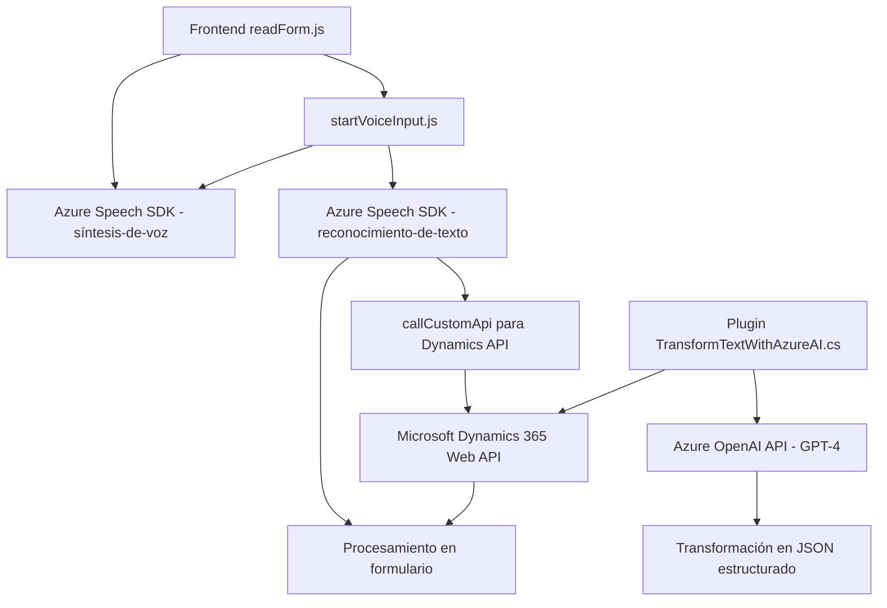

### Breve resumen técnico

El repositorio representa una solución integrada para un sistema CRM (posiblemente Microsoft Dynamics 365) que interactúa con formularios en el frontend usando voz y procesamiento de texto mediante servicios de Microsoft Azure Speech SDK y Azure OpenAI API. Combina componentes frontend (con JavaScript) y plugins en el backend (C#) para ofrecer reconocimiento de voz, síntesis de voz y transformación inteligente de texto con AI.

---

### Descripción de arquitectura

La solución tiene una arquitectura **híbrida**, con los siguientes elementos:
- **Frontend basado en N-capas**: La lógica del cliente está organizada mediante módulos funcionales (JavaScript).
- **Backend desacoplado en Plugins (SOA)**: Usa Azure OpenAI API para transformar datos y generar estructuras JSON. Se adapta al paradigma de **plugin architecture** para extender las funcionalidades del sistema CRM.
- **Integración de servicios de nube externos (Azure)**: Se emplean APIs para reconocimiento de voz, síntesis de voz y procesamiento de texto.
- **Dependencias declarativas asincrónicas**: Uso extensivo de patrones como callback para cargar SDKs en el frontend y realizar solicitudes API en el backend.

---

### Tecnologías usadas

**Frontend**:
- **JavaScript**:
  - Modularización con funciones claras y reutilizables.
  - Uso de callbacks y promesas para realizar solicitudes y manejar dependencias asincrónicas.
- **Azure Speech SDK**:
  - Reconocimiento de texto hablado y síntesis de voz.
- **Microsoft Dynamics 365 Web API**:
  - Integración directa con formularios del sistema para actualizar datos desde la interfaz del usuario.

**Backend**:
- **C# Plugins**:
  - Desarrollo con `IPlugin` para extender Dynamics CRM.
  - Llamadas HTTP a servicios externos (Azure OpenAI).
- **Azure OpenAI API**:
  - Procesamiento avanzado con modelos generativos (GPT-4) para transformar datos textual en JSON estructurado.

**Patrones y conceptos usados**:
- Modularización por funciones.
- Plugin architecture en el backend para Dynamics CRM.
- Service-oriented architecture (SOA) para interactuar con APIs externas.
- Asynchronous Networking (HTTP).
- Integración en tiempo real entre frontend y backend mediante APIs.

---

### Diagrama Mermaid válido para GitHub

---

### Conclusión final

El repositorio implementa una solución robusta orientada a aumentar la productividad en sistemas CRM mediante tecnologías modernas como reconocimiento de voz, síntesis de voz y transformación inteligente de texto con AI. La arquitectura híbrida desacopla funcionalidad entre frontend (N-capas) y backend (SOA/Plugins), proporcionando una estructura escalable y fácil de mantener. Además, la integración con servicios de nube (Azure) amplía sus capacidades en inteligencia artificial y procesamiento natural del lenguaje.