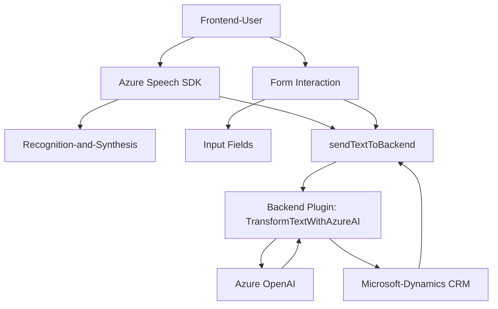

### Breve resumen técnico
El repositorio contiene tres archivos que implementan funcionalidad relacionada con el reconocimiento de voz, síntesis de texto a audio y transformación textual mediante un servicio de inteligencia artificial. Estos archivos trabajan en conjunto en un entorno de integración con Microsoft Dynamics 365 CRM y Azure Speech SDK/Azure OpenAI, y están orientados a mejorar la accesibilidad y automatización de datos mediante reconocimiento de voz y procesamiento.

---

### Descripción de la arquitectura
Esta solución tiene componentes backend y frontend, lo que la hace una arquitectura **Client-server** de tipo **n-capas**:
- **Frontend (`readForm.js`, `speechForm.js`)**: Módulos en JavaScript que interactúan directamente con formularios web para manejar reconocimiento de voz, síntesis de audio y actualización dinámica de campos utilizando Azure Speech SDK.
- **Backend (`TransformTextWithAzureAI.cs`)**: Plugin para Dynamics CRM que consume servicios de Azure OpenAI para transformar textos mediante reglas predefinidas, procesados en un formato JSON estructurado.

Adicionalmente, utiliza **patrones de integración de servicios externos** en ambas capas para interactuar con Azure Speech SDK y Azure OpenAI. El patrón de modularización está presente en todos los archivos, dividiendo conceptos y operaciones específicas en funciones o métodos.

---

### Tecnologías usadas
1. **Frontend**:
   - **JavaScript**:
     - Manejo de DOM para leer y actualizar valores en formularios.
     - Asynchronous JS (promesas y callbacks) para comunicación con servicios externos.
   - **Azure Speech SDK**: Reconocimiento y síntesis de voz en tiempo real.

2. **Backend**:
   - **C#** con `Microsoft.Xrm.Sdk` para desarrollar plugins de Dynamics CRM.
   - **Azure OpenAI** con HTTP REST API para la transformación de texto basada en reglas.
   - Serialización de datos JSON con `System.Text.Json` y `Newtonsoft.Json.Linq`.

3. **Servicios externos**:
   - **Azure Speech SDK** (usado en frontend para reconocimiento de voz y síntesis de texto a audio).
   - **Azure OpenAI** (usado en backend para transformar texto vía IA).

4. **Microsoft Dynamics 365 CRM**:
   - Plugins para extender la funcionalidad de la plataforma CRM mediante acceso a datos y ejecución de reglas.

---

### Diagrama Mermaid válido para GitHub

---

### Conclusión final
El análisis del repositorio indica una arquitectura **n-capas** distribuida entre frontend y backend. La capa del cliente en JavaScript gestiona la interacción con formularios web, junto con la síntesis y reconocimiento de voz a través del servicio `Azure Speech SDK`. En el lado del backend, un plugin de Dynamics CRM habilita la integración con `Azure OpenAI` para realizar procesamiento avanzado de textos.

Aunque los métodos están bien diseñados y la interacción entre librerías y servicios externos está clara, el archivo de frontend tiene funciones con múltiples responsabilidades y podría beneficiarse de una revisión para aumentar la cohesión y modularidad. Además, el enfoque de errores en el plugin backend se puede estandarizar para mejorar la robustez y trazabilidad del flujo de ejecución en caso de fallos imprevistos.

Si bien es una solución funcional, se puede evolucionar hacia una arquitectura **orientada a microservicios** para separar módulos y escalarlos de manera más eficiente en caso de crecimiento del sistema.