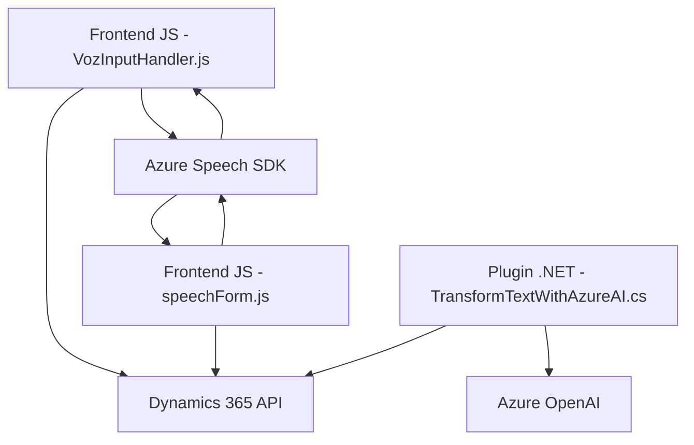

### Breve resumen técnico
El repositorio contiene tres elementos de diferentes alcances y responsabilidades:
1. **Archivos JavaScript** ("readForm.js" y "speechForm.js"): Funcionan como componentes frontend, integrados en un formulario de Dynamics 365, para procesar datos mediante interacción por voz y APIs externas (Azure Speech SDK).
2. **Plugin .NET** ("TransformTextWithAzureAI.cs"): Complementa la funcionalidad del sistema al realizar transformaciones de texto usando servicios de Azure OpenAI, todo implementado como un plugin basado en Dynamics CRM.

---

### Descripción de arquitectura
La solución tiene dos componentes principales:
1. **Cliente/Frontend (JavaScript)**:
    - Utiliza el patrón de arquitectura **n-capas** con funciones modulares que separan tareas específicas (procesamiento de voz, mapeo de campos, comunicación con APIs).
    - Integración con el servicio cloud **Azure Speech SDK** para síntesis de voz y transcripción.
    - Uso de APIs personalizadas de Dynamics 365 para interactuar con el backend.
    
2. **Backend (Plugins)**:
    - Implementa un modelo **plugin-based architecture** en Dynamics CRM para extender funcionalidades mediante eventos predefinidos (ejecutados en el servidor).
    - Funcionalidad de integración con **Azure OpenAI**, simulando un microservicio API REST.

Si bien esta solución no está completamente basada en microservicios, implementa patrones asociados a una arquitectura orientada a servicios (SOA) con altos niveles de integración y cohesión mediante APIs.

---

### Tecnologías usadas
1. **Frontend**:
    - Lenguaje: JavaScript.
    - SDK: `Azure Speech SDK`.
    - Plataforma: Dynamics 365 (form integration APIs e interacción con el cliente web).

2. **Backend**:
    - Lenguaje: C#.
    - Framework: Dynamics CRM SDK (Microsoft.Xrm.Sdk).
    - Librerías externas: `Newtonsoft.Json`, `System.Text.Json`, `System.Net.Http`.
    - Servicios externos: Azure OpenAI.

---

### Diagrama Mermaid
A continuación, un diagrama **Mermaid** válido que describe los componentes y las interacciones principales del sistema:

---

### Conclusión final
El repositorio exhibe una aplicación con una arquitectura mixta, combinando:
1. **Frontend**: Modular, enfocado en el procesamiento de voz vía SDK externo (Azure Speech) y comunicación con APIs personalizadas.
2. **Backend**: Plugin con integración de servicios externos (Azure OpenAI) para ejecución bajo reglas de negocio.

Si bien emplea construcción modular en el cliente y el plugin, podrían implementarse mejores prácticas en la generación del código, como:
- Separación estricta entre lógica de negocio y lógica de comunicación con servicios externos.
- Centralización de las configuraciones sensibles (ej. claves y endpoints).

El resultado es un sistema funcional y moderno, aunque el uso directo de librerías y la lógica personalizada dentro de múltiples ubicaciones sugieren que podrían beneficiarse de refactorizar algunos aspectos hacia una arquitectura **Hexagonal** o personalizada basada en microservicios.