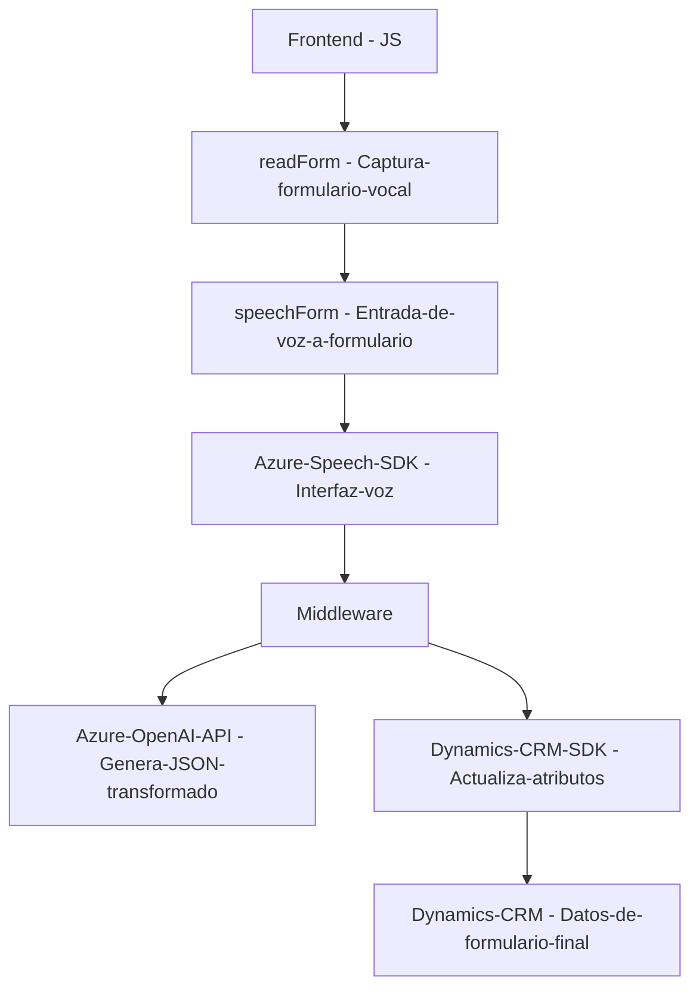

### Resumen Técnico
El repositorio combina elementos de **frontend y backend** para crear una solución basada en la interacción vocal en entornos de formularios. Está integrado con **Azure Speech SDK** para funcionalidades TTS (Text-to-Speech) y voz-a-texto, y **Azure OpenAI** para la generación de JSON estructurado. Además, implementa un plugin personalizado para Microsoft Dynamics CRM para vincular estos datos procesados con dicho sistema.

---

### Descripción de Arquitectura
La solución sigue una arquitectura basada en **n capas**, con una clara separación entre las responsabilidades del frontend (captura de datos y procesamiento preliminar) y la lógica de negocio en el backend (integración con Dynamics CRM y Azure OpenAI). Adicionalmente, utiliza conceptos de **integración de APIs externas** para extender las capacidades del sistema hacia servicios de cómputo en la nube.

---

### Tecnologías Usadas
1. **Frontend**: JavaScript.
   - **Frameworks/SDK**: 
     - Azure Speech SDK (para TTS y reconocimiento de voz).
     - Dynamics CRM SDK para manipulación de datos en formularios.
   
2. **Backend**: C#.
   - **Frameworks/SDK**:
     - Azure OpenAI API (integración para procesar texto).
     - Dynamics CRM SDK (event handling y operaciones CRUD).
     - HttpClient y JSON frameworks (System.Text.Json, Newtonsoft.Json) para comunicación y manipulación de datos.

3. **Patrones de diseño aplicados**:
   - **Callback/Promise**: Uso explícito de promesas y callbacks en el frontend para gestionar tareas asincrónicas, como carga de SDKs.
   - **Plugin-based Architecture**: Backend implementa la arquitectura típica de un plugin de Dynamics CRM, configurado para responder a eventos específicos como triggers.
   - **Adapter**: Transformación de datos CRM para integrarse con solicitudes de API.
   - **SOA/Microservicios**: El backend actúa como intermediario, conectando al frontend con servicios externos como Azure Speech SDK y OpenAI.

---

### Dependencias o Componentes Externos
- **Azure Speech SDK**: Usado para conversión TTS y reconocimiento de voz en formularios del frontend.
- **Azure OpenAI API**: Procesa texto y lo estructura en objetos JSON personalizados.
- **Microsoft Dynamics CRM SDK**: Facilita la conexión y manipulación directa de datos de CRM mediante `Xrm.WebApi` y plugins personalizados.
- **Formularios HTML/JS**: Utilizados como interfaz para la captura de datos y para actualizar desde transcripciones de voz u otros flujos del sistema.

---

### Diagrama Mermaid

---

### Conclusión Final
La solución integra tecnologías modernas en una arquitectura **n-capas distribuida**, diseñada para proporcionar interacción vocal de alta calidad en formularios con integración dinámica de datos en un sistema CRM. La elección de **Azure Speech SDK** y **Azure OpenAI API** muestra un alto enfoque en mejorar la experiencia del usuario mediante inteligencia artificial en combinación con servicios cloud. Sin embargo, sería recomendable seguir buenas prácticas, como almacenar configuraciones sensibles (como claves de API) fuera del código fuente y considerar formas de optimizar la escalabilidad y el uso de recursos en escenarios de alta demanda.