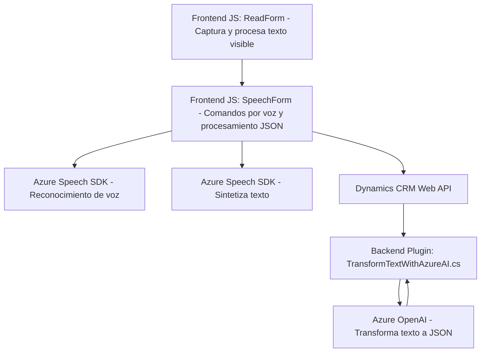

### Análisis técnico del repositorio

#### **Breve resumen técnico**
El repositorio implementa una solución que utiliza **Azure Speech SDK** y **Azure OpenAI** para integrar procesamiento de texto y voz en un entorno de formularios de Dynamics CRM. La solución destaca la accesibilidad y automatización, lo que sugiere que está diseñada como middleware o funcionalidad adicional dentro de una plataforma de CRM orientada a la interacción con el usuario.

---

#### **Descripción de arquitectura**
La arquitectura combina componentes asíncronos conectados en capas:
1. **Frontend Layer**: Archivos JavaScript (`readForm.js` y `speechForm.js`) interactúan directamente con los datos visibles en formularios y gestionan la transformación de texto mediante voz y APIs personalizadas.
2. **Backend/Plugin Layer**: Archivo C# (`TransformTextWithAzureAI.cs`) implementa servicios para procesar texto y transformar entradas de usuario en JSON estructurado, usando Azure OpenAI.
3. **API Layer**: Integraciones externas mediante `Azure Speech SDK` y `Azure OpenAI` conectan el sistema con servicios de nube para reconocimiento de voz, síntesis de texto, y transformaciones.

Este enfoque es similar a una **arquitectura de integración basada en eventos**, donde múltiples capas (frontend, backend y servicios en la nube) interactúan principalmente mediante callbacks, APIs y promesas.

---

#### **Tecnologías usadas**
1. **Azure Speech SDK**:
   - Procesamiento de voz: Reconocimiento de voz y síntesis de texto.
   - URL del SDK: `https://aka.ms/csspeech/jsbrowserpackageraw`.

2. **Azure OpenAI**:
   - Transformación avanzada de texto mediante modelos generativos.

3. **Dynamics CRM SDK**:
   - Manejo del contexto de ejecución de formularios, consultas y entidades.

4. **Lenguajes**:
   - JavaScript: Módulos frontend para conectarse con formularios y SDK de Azure.
   - C#: Plugins backend de Dynamics para integraciones con OpenAI.

---

#### **Patrones utilizados**
1. **Event-driven Programming**:
   - Funciones como `ensureSpeechSDKLoaded` y promesas asíncronas para manejar carga de SDK y respuestas de APIs.
2. **Service-Oriented Architecture (SOA)**:
   - Delegación de actividades específicas (transformación de texto, síntesis de voz) a servicios en la nube.
3. **Modularidad**:
   - Funciones claramente separadas según su propósito, facilitando mantenimiento y testing.
4. **Adapter Pattern** (en Plugins C#):
   - Adaptación entre Dynamics CRM y servicios como Azure OpenAI para consumir datos en JSON o texto.

---

#### **Dependencias o componentes externos**
1. **Azure Speech SDK**:
   - Reconocimiento y síntesis de voz.
2. **Azure OpenAI**:
   - Transformación de texto en JSON estructurado.
3. **Dynamics CRM SDK y Web API**:
   - Procesamiento y manipulación de formularios.
4. **Bibliotecas internas y externas** en C#:
   - `Newtonsoft.Json` (JSON), `System.Net.Http`, `Microsoft.Xrm.Sdk`.

---

#### **Diagrama Mermaid validado**

---

### **Conclusión final**
Este repositorio implementa una solución **orientada a la accesibilidad y automatización**, conectando formularios de Dynamics CRM con servicios avanzados de voz y transformación en la nube. La arquitectura modular y basada en eventos asegura eficiencia en la integración de APIs como `Azure Speech SDK` y `Azure OpenAI`, mientras que el uso de patrones como SOA y modularidad mejora la escalabilidad y mantenibilidad del código. Ideal para entornos de CRM, esta solución podría expandirse para uso en aplicaciones más generales centradas en accesibilidad y automatización mediante voz.