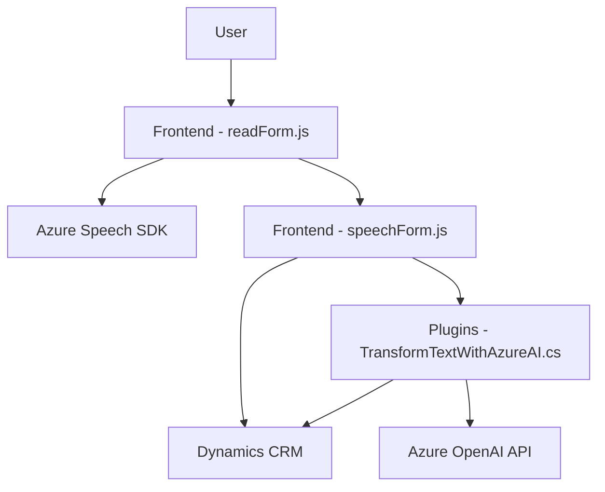

### Breve resumen técnico
El repositorio parece albergar una solución orientada a integrar servicios de reconocimiento de voz (Azure Speech SDK) y procesamiento de datos (Azure OpenAI) con formularios en una plataforma CRM (Dynamics 365). Los archivos proporcionados incluyen código frontend (JavaScript) para trabajar directamente con la interfaz web y un backend basado en plugins (.NET) que interactúan con Dynamics CRM.

---

### Descripción de arquitectura
La arquitectura sigue un enfoque de **n capas**, con capas bien definidas:
- **Capa de presentación**: Archivos de frontend, como `readForm.js` y `speechForm.js`, que interactúan directamente con el usuario mediante eventos en la interfaz web.
- **Capa de lógica empresarial**: Encapsulada en clases de plugins del backend (`TransformTextWithAzureAI.cs`) que procesan datos y gestionan la lógica relacionada con el servicio integrado (Azure OpenAI y la API de Dynamics CRM).
- **Capa de servicios externos**: Dependencias externas como Azure Speech SDK y Azure OpenAI API son responsables de procesamiento específico (entrada/salida de voz y transformación de texto).

Aunque no existe un uso explícito de una arquitectura **hexagonal** ni orientación a microservicios, se observa un diseño modular tanto en frontend como en backend.

---

### Tecnologías usadas
1. **Backend (.NET Framework)**:
   - `IPlugin` (Interface del SDK de Dynamics CRM).
   - Servicios como `HttpClient` para llamadas HTTP REST.
   - Azure OpenAI API (integración para procesamiento de texto).
2. **Frontend (JavaScript)**:
   - Azure Speech SDK (gestión de síntesis de voz y reconocimiento de voz).
   - DOM manipulation para interactuar con campos de formularios.
   - Dynamics 365 context APIs (`formContext` y `executionContext`).
3. **Dependencias externas**:
   - Azure Speech SDK (`https://aka.ms/csspeech/jsbrowserpackageraw`).
   - RESTful APIs para integración con Azure OpenAI.

---

### Diagrama Mermaid

---

### Conclusión final
El repositorio implementa un sistema que conecta eventos del usuario en formularios web de Dynamics CRM con servicios de reconocimiento de voz y procesamiento de texto. Usando una arquitectura **n capas**, integra tres componentes principales:
1. **Frontend**: Gestión de síntesis y entrada de voz para interacción directa en formularios.
2. **Backend**: Extensiones tipo plugin para el sistema CRM destinadas al procesamiento de datos en formato JSON.
3. **Servicios externos**: Azure Speech SDK y Azure OpenAI proporcionan capacidades avanzadas de síntesis, reconocimiento de voz e interpretación de texto.

El diseño modular asegura escalabilidad y reusabilidad, mientras que la integración con servicios externos amplifica la funcionalidad sin necesidad de implementar estos mecanismos desde cero. La solución es ideal para mejorar la accesibilidad y la interacción en aplicaciones CRM empresariales.